# Handler

## Handler工作流程


## Handler & Looper & MessageQueue三角关系简述

> Looper是运行在创建Handler所在线程中，这样一来Handler中的业务逻辑就被切换到创建Handler所在线程中去执行了

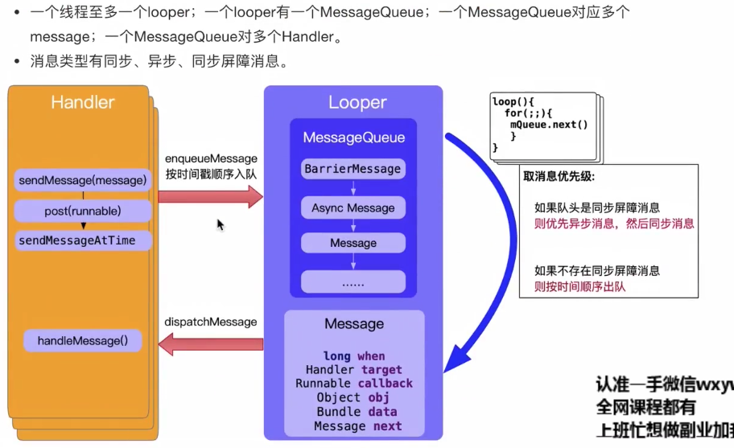


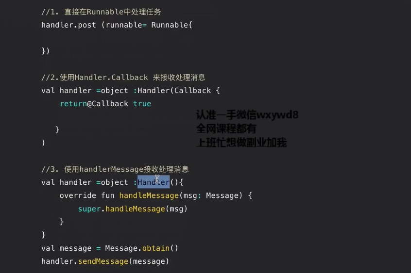

```java
		/**
     * Handle system messages here.
     * Handler 消息处理优先级代码（责任链模式）
     */
    public void dispatchMessage(@NonNull Message msg) {
        if (msg.callback != null) {
            //第一优先级：message.callback.run(),通过Handler.post(callback)设置
            handleCallback(msg);
        } else {
            if (mCallback != null) {
                //第二优先级：Handler.mCallback.handleMessage()，通过Handler(Callback{})设置
                if (mCallback.handleMessage(msg)) {//如果此处返回true,则不会调用下面的handleMessage()
                    return;
                }
            }
            //第三优先级：Handler.handleMessage(),通过Handler.handleMessage(msg)设置
            handleMessage(msg);
        }
    }
```

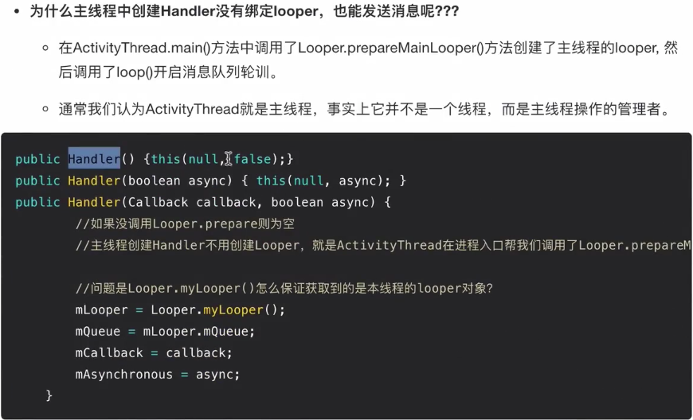

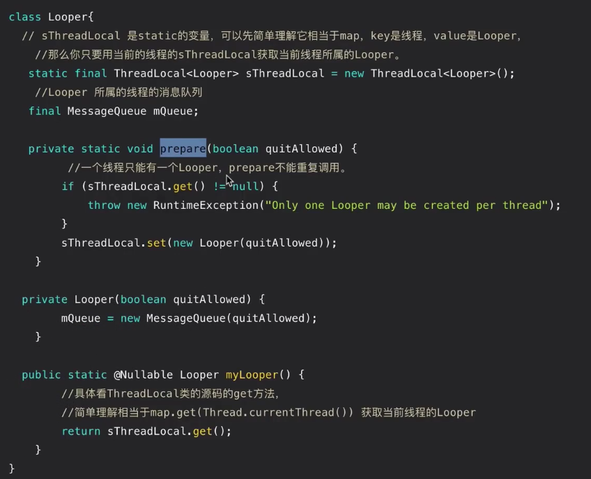

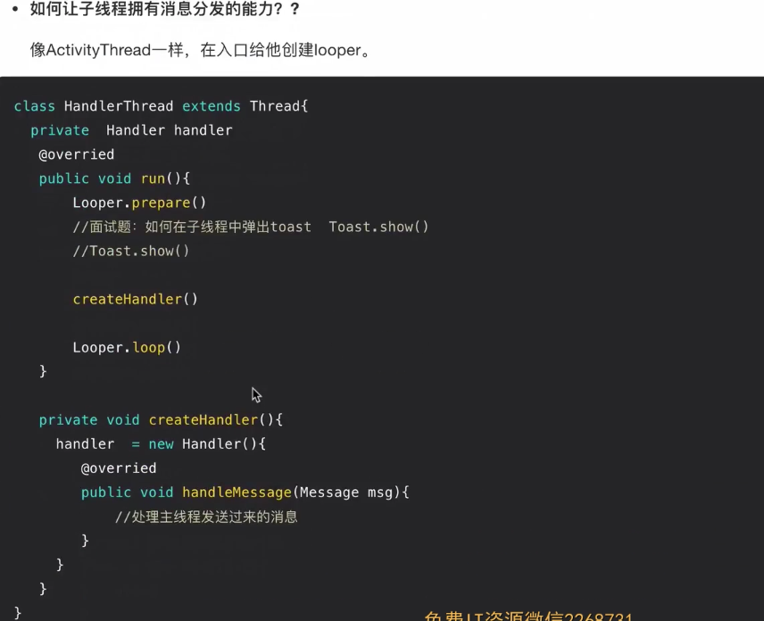

## 消息入队


- 获取消息体--享元设计模式


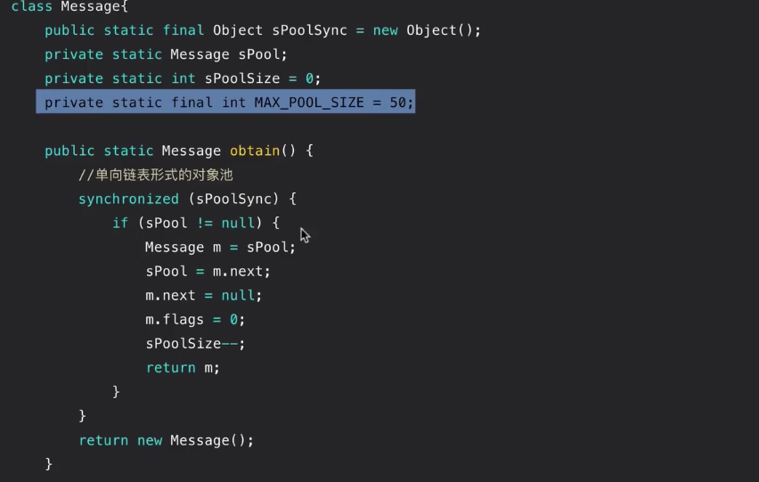


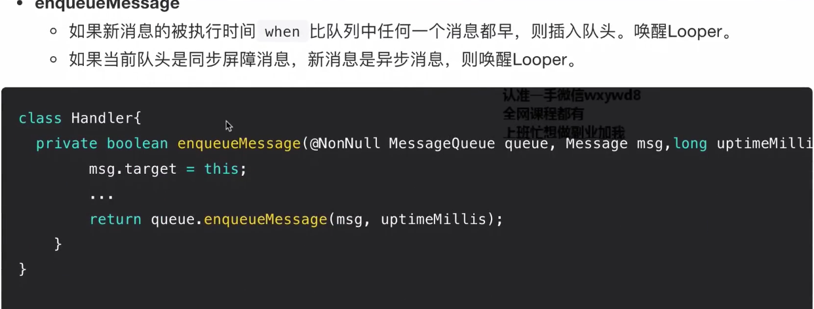

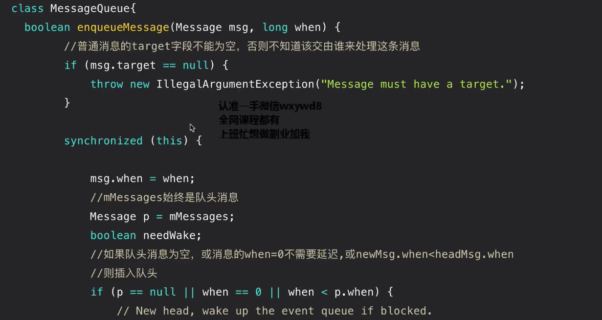


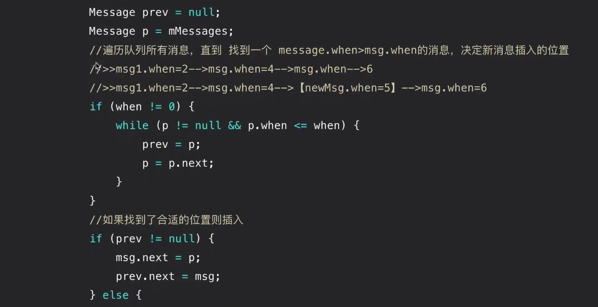


## 消息分发

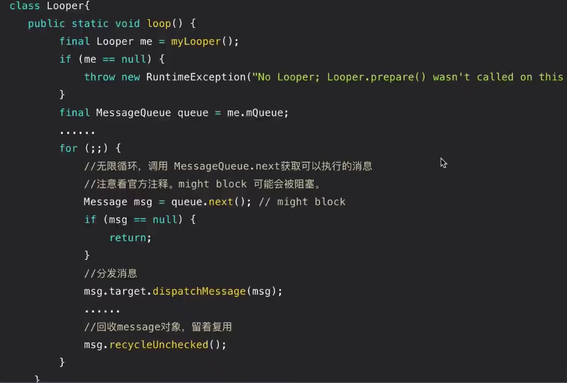


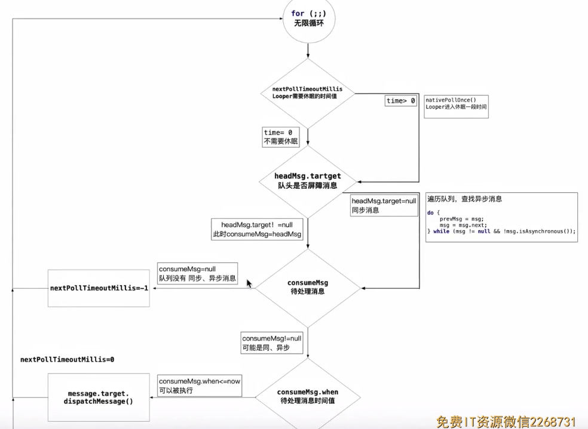


## ThreadLocal

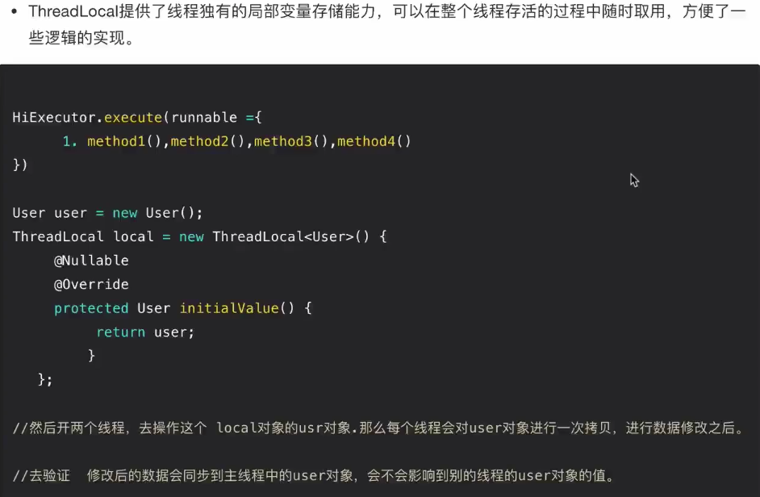

> 参阅：[正确理解Thread Local的原理与适用场景](http://www.jasongj.com/java/threadlocal/)

```java
/**
 * 经过验证：ThreadLocal具备线程隔离的作用。
 * ThreadLocal 适用于每个线程需要自己独立的实例且该实例需要在多个方法中被使用，也即变量在线程间隔离而在方法或类间共享的场景。
 * <p>
 * System.out: thread-thread-1 : User{name='wz', age=18, nickName='zs'} user hashCode:64133120
 * System.out: thread-thread-2 : User{name='ls', age=18, nickName='zs'} user hashCode:184215609
 * System.out: thread-main : User{name='ZhangSan', age=18, nickName='zs'} user hashCode:17980155
 */
public class ThreadLocalTest {
    public void test() {

        ThreadLocal<User> tl = new ThreadLocal<User>() {
            @Override
            protected User initialValue() {
                return new User("ZhangSan", 18, "zs");
            }
        };

        new Thread(new Runnable() {
            @Override
            public void run() {
                User user2 = tl.get();
                user2.setName("wz");
                System.out.println("thread-" + Thread.currentThread().getName() + " : " + tl.get() + " user hashCode:" + tl.get().hashCode());
            }
        }, "thread-1").start();

        new Thread(new Runnable() {
            @Override
            public void run() {
                User user3 = tl.get();
                user3.setName("ls");
                System.out.println("thread-" + Thread.currentThread().getName() + " : " + tl.get() + " user hashCode:" + tl.get().hashCode());
            }
        }, "thread-2").start();

        Handler handler = new Handler();
        handler.postDelayed(new Runnable() {
            @Override
            public void run() {
                System.out.println("thread-" + Thread.currentThread().getName() + " : " + tl.get() + " user hashCode:" + tl.get().hashCode());
            }
        }, 1000);

    }
}

class User {
    String name;
    int age;
    String nickName;

    public void setName(String name) {
        this.name = name;
    }

    public void setAge(int age) {
        this.age = age;
    }

    public User(String name, int age, String nickName) {
        this.name = name;
        this.age = age;
        this.nickName = nickName;
    }

    @Override
    public String toString() {
        return "User{" +"name='" + name + '\'' +", age=" + age +", nickName='" + nickName + '\'' +'}';
    }
}
```


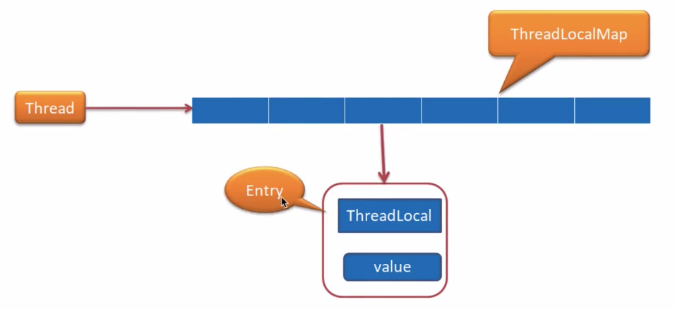

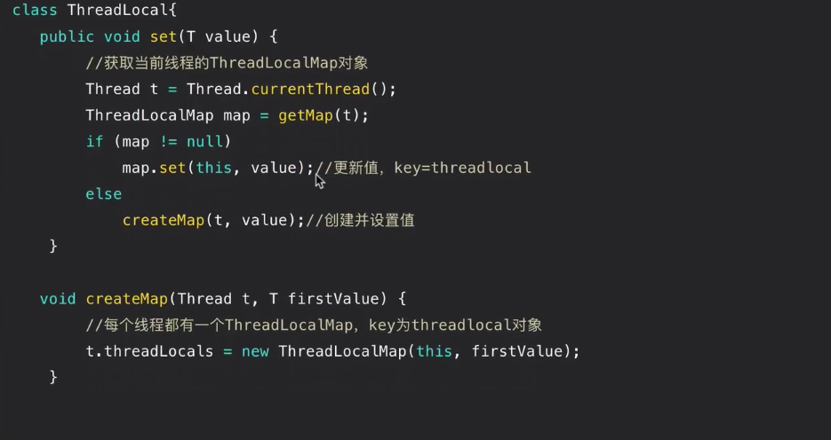

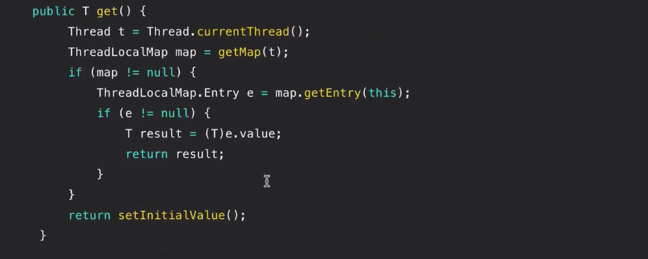

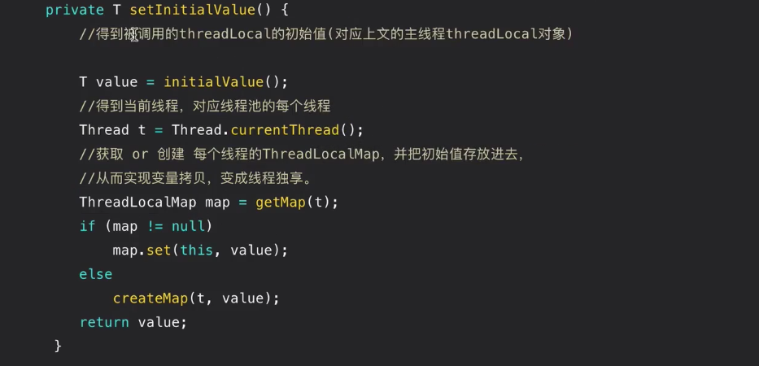

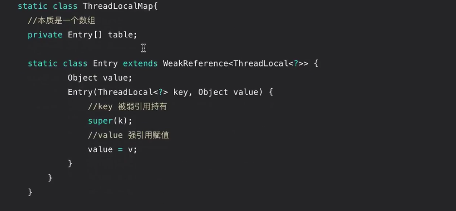


## HandlerThread

```java
HandlerThread handlerThread = new HandlerThread("handler thread");
handlerThread.start();
Handler handler = new Handler(handlerThread.getLooper()) {
  @Override
  public void handleMessage(Message msg) {
    System.out.println("HandlerThread current thread: " + Thread.currentThread());
    //System.out: HandlerThread current thread: Thread[handler thread,5,main]
  }
};
handler.sendEmptyMessage(1);

......
  
//HandlerThread的run方法是一个无限循环，因此当不需要使用的时候通过quit或者quitSafely方法来终止线程的执行。
//结束线程，即停止线程的消息循环
handlerThread.quit();
```

## IdleHandler

```java
Looper.myQueue().addIdleHandler(new MessageQueue.IdleHandler() {
  //这个接口方法是在消息队列全部处理完成后或者是在阻塞的过程中等待更多的消息的时候调用的，
  //返回值false表示只回调一次，true表示可以接收多次回调。
  @Override
  public boolean queueIdle() {
    //do Something...
    return false;
  }
});
```

## 经典八问


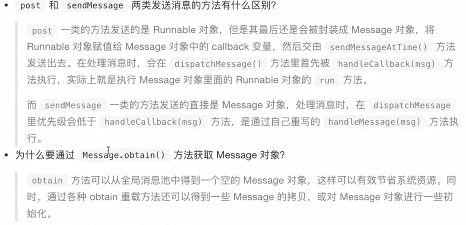


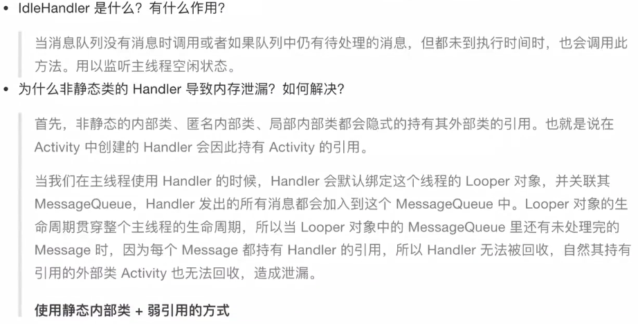


## 代码示例

### ActivityThread.java

```java
public final class ActivityThread extends ClientTransactionHandler {
	final Looper mLooper = Looper.myLooper();
  final H mH = new H();
  ...
  class H extends Handler {
  	public void handleMessage(Message msg) {
      switch (msg.what) {
          ...
      }
    }
  }

 public static void main(String[] args) {
        
   Looper.prepareMainLooper();
   
   ActivityThread thread = new ActivityThread();
   thread.attach(false, startSeq);

   if (sMainThreadHandler == null) {
     sMainThreadHandler = thread.getHandler();
   }

   Looper.loop();
	}
  
}
```

### Handler.java

```java
public class Handler {
  final Looper mLooper;
  final MessageQueue mQueue;
  final Callback mCallback;
  IMessenger mMessenger;
  
  public Handler(@Nullable Callback callback, boolean async) {
    if (FIND_POTENTIAL_LEAKS) {
      final Class<? extends Handler> klass = getClass();
      if ((klass.isAnonymousClass() || klass.isMemberClass() || klass.isLocalClass()) &&
          (klass.getModifiers() & Modifier.STATIC) == 0) {
        Log.w(TAG, "The following Handler class should be static or leaks might occur: " +
              klass.getCanonicalName());
      }
    }

    mLooper = Looper.myLooper();
    if (mLooper == null) {
      throw new RuntimeException( "Can't create handler inside thread " + Thread.currentThread()
        + " that has not called Looper.prepare()");
    }
    mQueue = mLooper.mQueue;
    mCallback = callback;
    mAsynchronous = async;
  }
  
  //消息的处理，责任链模式
  public void dispatchMessage(@NonNull Message msg) {
    if (msg.callback != null) {
      handleCallback(msg);
    } else {
      if (mCallback != null) {
        if (mCallback.handleMessage(msg)) {
          return;
        }
      }
      handleMessage(msg);
    }
  }
  
  public boolean sendMessageAtTime(@NonNull Message msg, long uptimeMillis) {
    MessageQueue queue = mQueue;
    if (queue == null) {
      RuntimeException e = new RuntimeException( this + " sendMessageAtTime() called with no mQueue");
      Log.w("Looper", e.getMessage(), e);
      return false;
    }
    return enqueueMessage(queue, msg, uptimeMillis);
  }
  
  private boolean enqueueMessage(@NonNull MessageQueue queue, @NonNull Message msg,long uptimeMillis) {
    msg.target = this;
    msg.workSourceUid = ThreadLocalWorkSource.getUid();

    if (mAsynchronous) {
      msg.setAsynchronous(true);
    }
    return queue.enqueueMessage(msg, uptimeMillis);
  }
  
}
```

### Looper.java

```java
public final class Looper {
	static final ThreadLocal<Looper> sThreadLocal = new ThreadLocal<Looper>();
  private static Looper sMainLooper;  // guarded by Looper.class
  private static Observer sObserver;
  final MessageQueue mQueue;
  final Thread mThread;
  
  private Looper(boolean quitAllowed) {
    mQueue = new MessageQueue(quitAllowed);
    mThread = Thread.currentThread();
  }
  
  private static void prepare(boolean quitAllowed) {
    if (sThreadLocal.get() != null) {
      throw new RuntimeException("Only one Looper may be created per thread");
    }
    sThreadLocal.set(new Looper(quitAllowed));
  }
  
  public static @Nullable Looper myLooper() {
    return sThreadLocal.get();
  }
  
  public static void loop() {
    final Looper me = myLooper();
    if (me == null) {
      throw new RuntimeException("No Looper; Looper.prepare() wasn't called on this thread.");
    }
    final MessageQueue queue = me.mQueue;

    // Make sure the identity of this thread is that of the local process,
    // and keep track of what that identity token actually is.
    Binder.clearCallingIdentity();
    final long ident = Binder.clearCallingIdentity();

    boolean slowDeliveryDetected = false;

    for (;;) {
      Message msg = queue.next(); // might block
      if (msg == null) {
        // No message indicates that the message queue is quitting.
        return;
      }

      // Make sure the observer won't change while processing a transaction.
      final Observer observer = sObserver;

      final long traceTag = me.mTraceTag;
      long slowDispatchThresholdMs = me.mSlowDispatchThresholdMs;
      long slowDeliveryThresholdMs = me.mSlowDeliveryThresholdMs;
      if (thresholdOverride > 0) {
        slowDispatchThresholdMs = thresholdOverride;
        slowDeliveryThresholdMs = thresholdOverride;
      }
      final boolean logSlowDelivery = (slowDeliveryThresholdMs > 0) && (msg.when > 0);
      final boolean logSlowDispatch = (slowDispatchThresholdMs > 0);

      final boolean needStartTime = logSlowDelivery || logSlowDispatch;
      final boolean needEndTime = logSlowDispatch;

      final long dispatchStart = needStartTime ? SystemClock.uptimeMillis() : 0;
      final long dispatchEnd;
      Object token = null;
      if (observer != null) {
        token = observer.messageDispatchStarting();
      }
      long origWorkSource = ThreadLocalWorkSource.setUid(msg.workSourceUid);
      try {
        msg.target.dispatchMessage(msg);
        if (observer != null) {
          observer.messageDispatched(token, msg);
        }
        dispatchEnd = needEndTime ? SystemClock.uptimeMillis() : 0;
      } catch (Exception exception) {
        if (observer != null) {
          observer.dispatchingThrewException(token, msg, exception);
        }
        throw exception;
      } finally {
        ThreadLocalWorkSource.restore(origWorkSource);
        if (traceTag != 0) {
          Trace.traceEnd(traceTag);
        }
      }
      if (logSlowDelivery) {
        if (slowDeliveryDetected) {
          if ((dispatchStart - msg.when) <= 10) {
            Slog.w(TAG, "Drained");
            slowDeliveryDetected = false;
          }
        } else {
          if (showSlowLog(slowDeliveryThresholdMs, msg.when, dispatchStart, "delivery", msg)) {
            // Once we write a slow delivery log, suppress until the queue drains.
            slowDeliveryDetected = true;
          }
        }
      }
   
      msg.recycleUnchecked();
    }
  }
  
}
```

### MessageQueue.java

入队：根据时间排序，当队列满的时候，阻塞，直到用户通过next取出消息。当next方法被调用，通知MessagQueue可以进行消息的入队。

出队：由Looper.loop(),启动轮询器，对queue进行轮询。当消息达到执行时间就取出来。当message queue为空的时候，队列阻塞，等消息队列调用enqueuer Message的时候通知队列，可以取出消息，停止阻塞。


```java
public final class MessageQueue {
  
  boolean enqueueMessage(Message msg, long when) {
    if (msg.target == null) {
      throw new IllegalArgumentException("Message must have a target.");
    }
    if (msg.isInUse()) {
      throw new IllegalStateException(msg + " This message is already in use.");
    }

    synchronized (this) {
      if (mQuitting) {
        msg.recycle();
        return false;
      }

      msg.markInUse();
      msg.when = when;
      Message p = mMessages;
      boolean needWake;
      if (p == null || when == 0 || when < p.when) {
        // New head, wake up the event queue if blocked.
        msg.next = p;
        mMessages = msg;
        needWake = mBlocked;
      } else {
        // Inserted within the middle of the queue.  Usually we don't have to wake
        // up the event queue unless there is a barrier at the head of the queue
        // and the message is the earliest asynchronous message in the queue.
        needWake = mBlocked && p.target == null && msg.isAsynchronous();
        Message prev;
        for (;;) {
          prev = p;
          p = p.next;
          if (p == null || when < p.when) {
            break;
          }
          if (needWake && p.isAsynchronous()) {
            needWake = false;
          }
        }
        msg.next = p; // invariant: p == prev.next
        prev.next = msg;
      }

      // We can assume mPtr != 0 because mQuitting is false.
      if (needWake) {//唤醒
        nativeWake(mPtr);
      }
    }
    return true;
  }
  
   Message next() {
     // Return here if the message loop has already quit and been disposed.
     // This can happen if the application tries to restart a looper after quit
     // which is not supported.
     final long ptr = mPtr;
     if (ptr == 0) {
       return null;
     }

     int pendingIdleHandlerCount = -1; // -1 only during first iteration
     int nextPollTimeoutMillis = 0;
     for (;;) {
       if (nextPollTimeoutMillis != 0) {
         Binder.flushPendingCommands();
       }

       //没有消息的时候队列阻塞，在native层阻塞，释放时间片
       //主线程会释放CPU资源进入休眠状态，直到下个消息到达或者有事务发生
       nativePollOnce(ptr, nextPollTimeoutMillis);

       synchronized (this) {
         // Try to retrieve the next message.  Return if found.
         final long now = SystemClock.uptimeMillis();
         Message prevMsg = null;
         Message msg = mMessages;
         if (msg != null && msg.target == null) {
           // Stalled by a barrier.  Find the next asynchronous message in the queue.
           do {
             prevMsg = msg;
             msg = msg.next;
           } while (msg != null && !msg.isAsynchronous());
         }
         if (msg != null) {
           //根据时间排序
           if (now < msg.when) {
             // Next message is not ready.  Set a timeout to wake up when it is ready.
             nextPollTimeoutMillis = (int) Math.min(msg.when - now, Integer.MAX_VALUE);
           } else {
             // Got a message.
             mBlocked = false;
             if (prevMsg != null) {
               prevMsg.next = msg.next;
             } else {
               mMessages = msg.next;
             }
             msg.next = null;
             if (DEBUG) Log.v(TAG, "Returning message: " + msg);
             msg.markInUse();
             return msg;
           }
         } else {
           // No more messages.
           nextPollTimeoutMillis = -1;
         }

         // Process the quit message now that all pending messages have been handled.
         if (mQuitting) {
           dispose();
           return null;
         }

         // If first time idle, then get the number of idlers to run.
         // Idle handles only run if the queue is empty or if the first message
         // in the queue (possibly a barrier) is due to be handled in the future.
         if (pendingIdleHandlerCount < 0
             && (mMessages == null || now < mMessages.when)) {
           pendingIdleHandlerCount = mIdleHandlers.size();
         }
         if (pendingIdleHandlerCount <= 0) {
           // No idle handlers to run.  Loop and wait some more.
           mBlocked = true;
           continue;
         }

         if (mPendingIdleHandlers == null) {
           mPendingIdleHandlers = new IdleHandler[Math.max(pendingIdleHandlerCount, 4)];
         }
         mPendingIdleHandlers = mIdleHandlers.toArray(mPendingIdleHandlers);
       }

       // Run the idle handlers.
       // We only ever reach this code block during the first iteration.
       for (int i = 0; i < pendingIdleHandlerCount; i++) {
         final IdleHandler idler = mPendingIdleHandlers[i];
         mPendingIdleHandlers[i] = null; // release the reference to the handler

         boolean keep = false;
         try {
           keep = idler.queueIdle();
         } catch (Throwable t) {
           Log.wtf(TAG, "IdleHandler threw exception", t);
         }

         if (!keep) {
           synchronized (this) {
             mIdleHandlers.remove(idler);
           }
         }
       }

       // Reset the idle handler count to 0 so we do not run them again.
       pendingIdleHandlerCount = 0;

       // While calling an idle handler, a new message could have been delivered
       // so go back and look again for a pending message without waiting.
       nextPollTimeoutMillis = 0;
     }
   }
}
```

### Message.java

```java
public final class Message implements Parcelable {
  public static final Object sPoolSync = new Object();
  private static Message sPool;
  private static int sPoolSize = 0;

  //最大的消息池为50，超过将会阻塞
  private static final int MAX_POOL_SIZE = 50;
  
  public static Message obtain() {
    synchronized (sPoolSync) {
      if (sPool != null) {
        Message m = sPool;
        sPool = m.next;
        m.next = null;
        m.flags = 0; // clear in-use flag
        sPoolSize--;
        return m;
      }
    }
    return new Message();
  }
  
  void recycleUnchecked() {
    // Mark the message as in use while it remains in the recycled object pool.
    // Clear out all other details.
    flags = FLAG_IN_USE;
    what = 0;
    arg1 = 0;
    arg2 = 0;
    obj = null;
    replyTo = null;
    sendingUid = UID_NONE;
    workSourceUid = UID_NONE;
    when = 0;
    target = null;
    callback = null;
    data = null;

    synchronized (sPoolSync) {
      if (sPoolSize < MAX_POOL_SIZE) {
        next = sPool;
        sPool = this;
        sPoolSize++;
      }
    }
  }
}
```

## 参考

[Android 消息机制](https://blog.csdn.net/qian520ao/article/details/78262289?locationNum=2&fps=1)

[Android消息机制1-Handler(Java层)](http://gityuan.com/2015/12/26/handler-message-framework/)