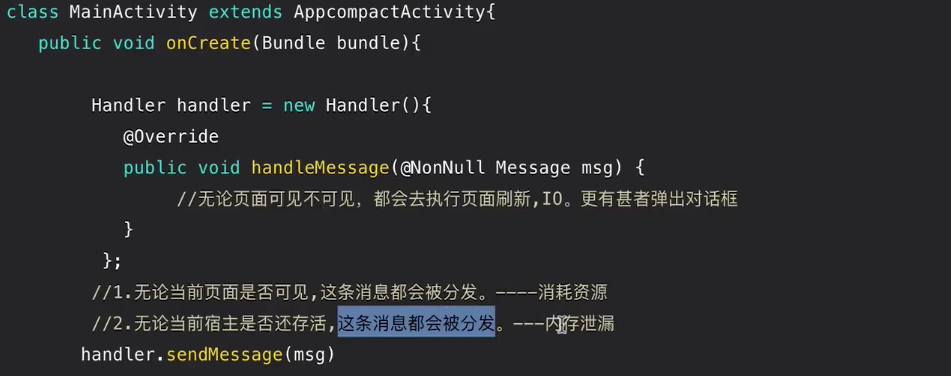
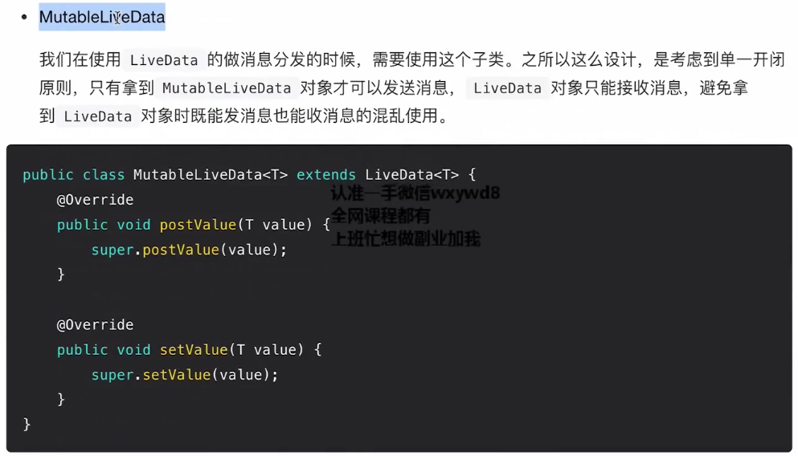
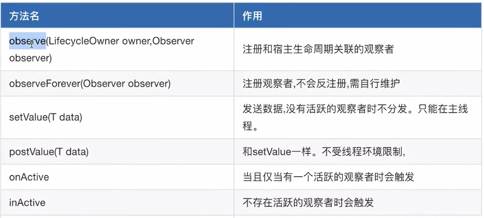
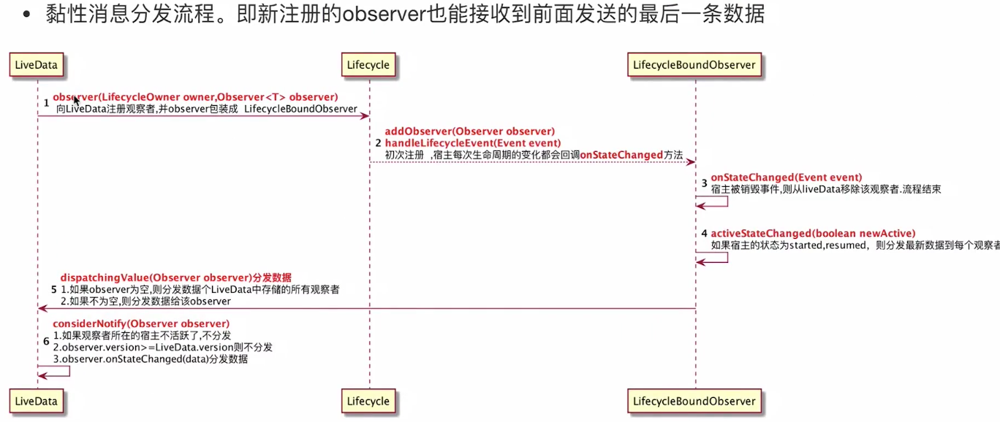
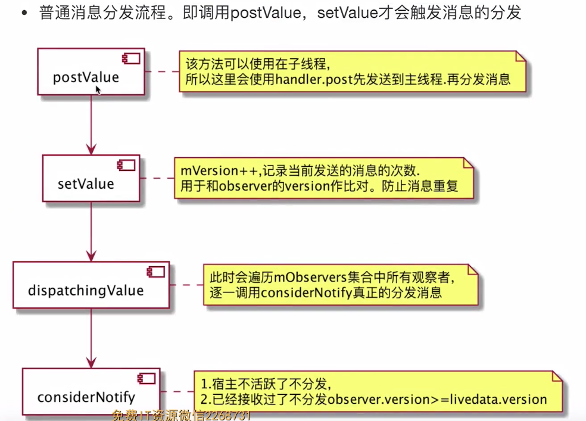
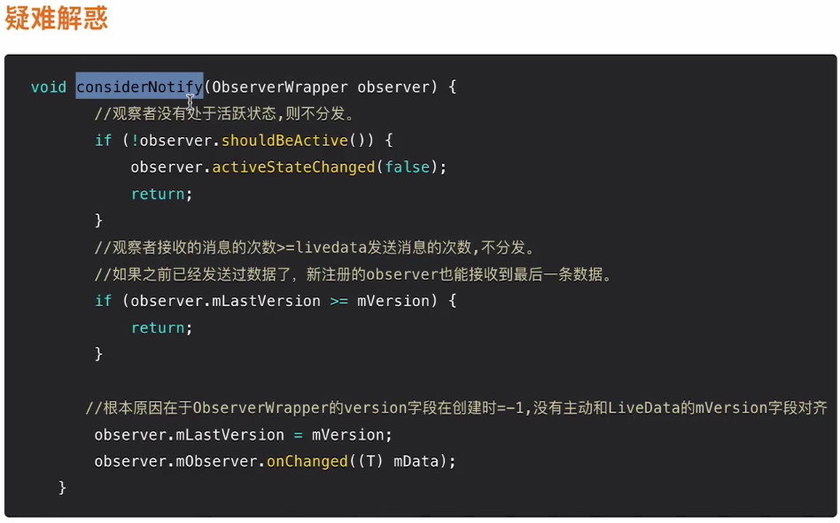
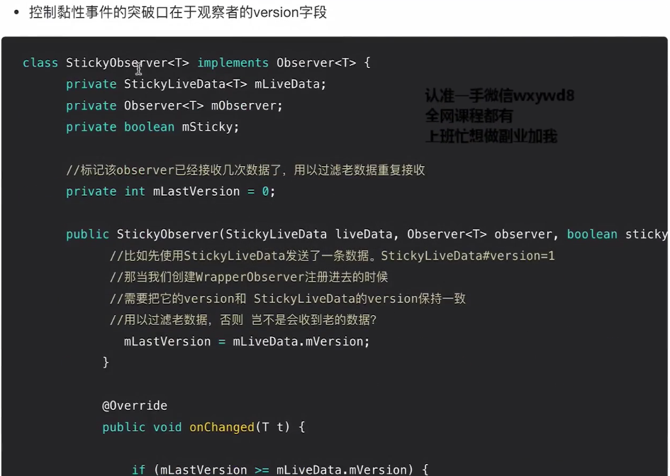
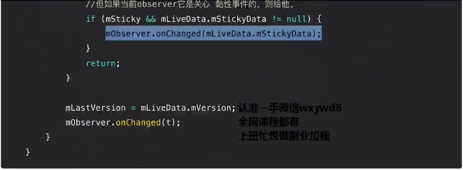

# LiveData

## 什么是LivaData


> 活跃状态：Observer所在宿主处在started，resumed状态




## LivaData的几种用法




## LiveData的核心用法



## LiveData实现原理





## LivaDataBus








```java
package org.devio.hi.library.util

import androidx.lifecycle.*
import java.util.concurrent.ConcurrentHashMap

object HiDataBus {

    private val eventMap = ConcurrentHashMap<String, StickyLiveData<*>>()
    fun <T> with(eventName: String): StickyLiveData<T> {
        //基于事件名称 订阅、分发消息，
        //由于 一个 livedata 只能发送 一种数据类型
        //所以 不同的event事件，需要使用不同的livedata实例 去分发
        var liveData = eventMap[eventName]
        if (liveData == null) {
            liveData = StickyLiveData<T>(eventName)
            eventMap[eventName] = liveData
        }
        return liveData as StickyLiveData<T>
    }

    //通过一堆的反射，获取livedata当中的mversion字段，来控制黏性数据的分发与否，但是我们认为这种反射不够优雅。
    class StickyLiveData<T>(private val eventName: String) : LiveData<T>() {
        internal var mStickyData: T? = null
        internal var mVersion = 0

        fun setStickyData(stickyData: T) {
            mStickyData = stickyData
            setValue(stickyData)
            //就是在主线程去发送数据
        }

        fun postStickyData(stickyData: T) {
            mStickyData = stickyData
            postValue(stickyData)
            //不受线程的限制
        }

        override fun setValue(value: T) {
            mVersion++
            super.setValue(value)
        }

        override fun observe(owner: LifecycleOwner, observer: Observer<in T>) {
            observerSticky(owner, false, observer)
        }

        fun observerSticky(owner: LifecycleOwner, sticky: Boolean, observer: Observer<in T>) {
            //允许指定注册的观察则 是否需要关心黏性事件
            //sticky =true, 如果之前存在已经发送的数据，那么这个observer会受到之前的黏性事件消息
            owner.lifecycle.addObserver(LifecycleEventObserver { source, event ->
                //监听 宿主 发生销毁事件，主动把livedata 移除掉。
                if (event == Lifecycle.Event.ON_DESTROY) {
                    eventMap.remove(eventName)
                }
            })
            super.observe(owner, StickyObserver(this, sticky, observer))
        }
    }

    class StickyObserver<T>(
        val stickyLiveData: StickyLiveData<T>,
        val sticky: Boolean,
        val observer: Observer<in T>
    ) : Observer<T> {
        //lastVersion 和livedata的version 对齐的原因，就是为控制黏性事件的分发。
        //sticky 不等于true , 只能接收到注册之后发送的消息，如果要接收黏性事件，则sticky需要传递为true
        private var lastVersion = stickyLiveData.mVersion
        override fun onChanged(t: T) {

            if (lastVersion >= stickyLiveData.mVersion) {
                //就说明stickyLiveData  没有更新的数据需要发送。
                if (sticky && stickyLiveData.mStickyData != null) {
                    observer.onChanged(stickyLiveData.mStickyData)
                }
                return
            }

            lastVersion = stickyLiveData.mVersion
            observer.onChanged(t)
        }

    }
}
```

