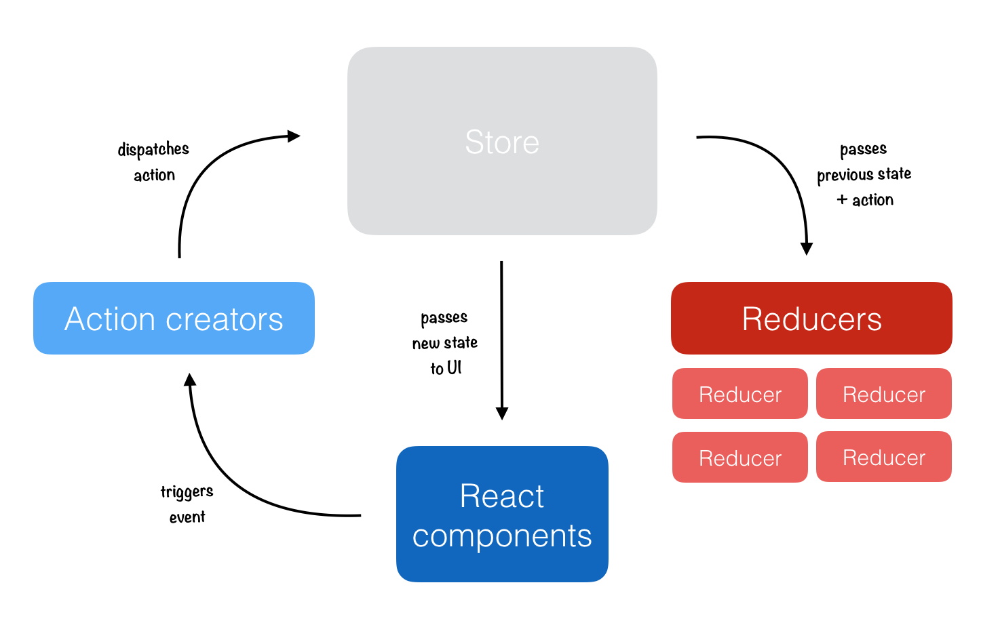

[期待已久的新教程上线啦！解锁React Native开发新姿势，一网打尽React Native最新与最热技术，点我Get!!!](https://coding.imooc.com/class/304.html)



为了帮助大家快速上手在React Native与Redux开发，在这本文中将向大家介绍[如何在React Native中使用Redux?](https://coding.imooc.com/class/304.html)，以及一些[必备基础以及高级知识](https://coding.imooc.com/class/304.html)。

> 本参考了[《新版React Native+Redux打造高质量上线App》](https://coding.imooc.com/class/304.html)课程的部分讲解，更多关于React Native与Redux的实战技巧可在[《新版React Native+Redux打造高质量上线App》](https://coding.imooc.com/class/304.html)中查看。

> 那么[如何在React Native中使用Redux?](http://coding.imooc.com/class/304.html)呢？

### [准备工作](http://coding.imooc.com/class/304.html)

根据需要安装以下组件。

- redux(必选)
- react-redux(必选)：redux作者为方便在react上使用redux开发的一个用户react上的redux库；
- redux-devtools(可选)：Redux开发者工具支持热加载、action 重放、自定义UI等功能；
- redux-thunk：实现action异步的middleware；
- redux-persist(可选)：支持store本地持久化；
- redux-observable(可选)：实现可取消的action；

```
npm install --save redux
npm install --save react-redux
npm install --save-dev redux-devtools
```

### [react-redux介绍](http://coding.imooc.com/class/304.html)

`react-redux`是Redux 官方提供的 React 绑定库。 具有高效且灵活的特性。

#### [视图层绑定引入了几个概念：](http://coding.imooc.com/class/304.html)

- `<Provider>` 组件： 这个组件需要包裹在整个组件树的最外层。这个组件让根组件的所有子孙组件能够轻松的使用 connect() 方法绑定 store。
- `connect()`：这是 react-redux 提供的一个方法。如果一个组件想要响应状态的变化，就把自己作为参数传给 connect() 的结果，connect() 方法会处理与 store 绑定的细节，并通过 selector 确定该绑定 store 中哪一部分的数据。
- `selector`：这是你自己编写的一个函数。这个函数声明了你的组件需要整个 store 中的哪一部分数据作为自己的 props。
- `dispatch `：每当你想要改变应用中的状态时，你就要 dispatch 一个 action，这也是唯一改变状态的方法。

> react-redux提供以下API:

- Provider
- connect

#### [Provider](http://coding.imooc.com/class/304.html)

> API原型：`<Provider store>`

使组件层级中的 connect() 方法都能够获得 Redux store(将store传递给App框架)。通常情况下我们需要将根组件嵌套在 标签 中才能使用 connect() 方法。

```
class Index extends Component {
    render() {
        return  <Provider store={configureStore()}>
            <AppWithNavigationState />
        </Provider>     }
}
```

> 以上代码片段的完整部分可以在[课程源码](https://coding.imooc.com/down/304.html)中查找。

在上述代码中我们用 标签包裹了根组件`AppWithNavigationState`，然后为它设置了store参数，store (Redux Store)接受的是应用程序中唯一的 Redux store 对象。

##### [connect](http://coding.imooc.com/class/304.html)

> API原型：`connect([mapStateToProps], [mapDispatchToProps], [mergeProps], [options])`

连接 React 组件与 Redux store，连接操作会返回一个新的与 Redux store 连接的组件类，并且连接操作不会改变原来的组件类。

> ```
> react-redux`提供了connect函数，connect是一个高阶函数，首先传入mapStateToProps、mapDispatchToProps，然后返回一个生产 Component 的函数(wrapWithConnect)，然后再将真正的Component作为参数传入wrapWithConnect(MyComponent)，这样就生产出一个经过包裹的Connect组件，如:`export default connect(mapStateToProps)(HomePage);
> ```

### [使用步骤](http://coding.imooc.com/class/304.html)

- [创建action](http://coding.imooc.com/class/304.html)

  ```react
    /* * action 类型 */
  	
    export const ADD_TODO = 'ADD_TODO';
    export const COMPLETE_TODO = 'COMPLETE_TODO';
    export const SET_VISIBILITY_FILTER = 'SET_VISIBILITY_FILTER'
  	
    /* * 其它的常量 */
  	
    export const VisibilityFilters = {
        SHOW_ALL: 'SHOW_ALL',
        SHOW_COMPLETED: 'SHOW_COMPLETED',
        SHOW_ACTIVE: 'SHOW_ACTIVE'
    };
  	
    /* * action 创建函数 */
  	
    export function addTodo(text) {
        return { type: ADD_TODO, text }
    }
  	
    export function completeTodo(index) {
        return { type: COMPLETE_TODO, index }
    }
  	
    export function setVisibilityFilter(filter) {
        return { type: SET_VISIBILITY_FILTER, filter }
    }
  ```

  > 以上代码片段的完整部分可以在[课程源码](https://coding.imooc.com/down/304.html)中查找。

- [创建reducer](http://coding.imooc.com/class/304.html)

  ```react
    import { combineReducers } from 'redux'
    import { ADD_TODO, COMPLETE_TODO, SET_VISIBILITY_FILTER, VisibilityFilters } from './actions'
    const { SHOW_ALL } = VisibilityFilters
  	
    function visibilityFilter(state = SHOW_ALL, action) {
        switch (action.type) {
            case SET_VISIBILITY_FILTER:
                return action.filter
            default:
                return state
        }
    }
  	
    function todos(state = [], action) {
        switch (action.type) {
            case ADD_TODO:
                return [
                    ...state,
                    {
                        text: action.text,
                        completed: false
                    }
                ]
            case COMPLETE_TODO:
                return [
                    ...state.slice(0, action.index),
                    Object.assign({}, state[action.index], {
                        completed: true
                    }),
                    ...state.slice(action.index + 1)
                ]
            default:
                return state
        }
    }
    //通过combineReducers将多个reducer合并成一个rootReducer
    const todoApp = combineReducers({
        visibilityFilter,
        todos
    })
  	
    export default todoApp
  ```

  > 以上代码片段的完整部分可以在[课程源码](https://coding.imooc.com/down/304.html)中查找。

这里通过Redux提供的`combineReducers`方法，将多个reducer聚合成一个rootReducer。

- [创建store](http://coding.imooc.com/class/304.html)

  ```react
    import {createStore} from 'redux'
    import todoApp from './reducers'
  	
    let store = createStore(todoApp)
  ```

  这里通过Redux提供的`createStore `方法，创建了store；

- 使用`<Provider>`包裹根组件

  ```react
    import {Provider} from 'react-redux'
    export default class index extends Component {
        render() {
            return (<Provider store={store}>
                <App/>
            </Provider>)       }
    }	
  ```

  > 以上代码片段的完整部分可以在[课程源码](https://coding.imooc.com/down/304.html)中查找。

这里我们使用`react-redux`提供的`<Provider>`来包裹我们的根组件，让根组件的所以子组件都能使用 connect() 方法绑定 store。

- [包装 component：](http://coding.imooc.com/class/304.html)

  ```react
    function selectTodos(todos, filter) {
        switch (filter) {
            case VisibilityFilters.SHOW_ALL:
                return todos
            case VisibilityFilters.SHOW_COMPLETED:
                return todos.filter(todo => todo.completed)
            case VisibilityFilters.SHOW_ACTIVE:
                return todos.filter(todo => !todo.completed)
        }
    }
  	
    // Which props do we want to inject, given the global state?
    // Note: use https://github.com/faassen/reselect for better performance.
    function select(state) {
        return {
            visibleTodos: selectTodos(state.todos, state.visibilityFilter),
            visibilityFilter: state.visibilityFilter
        }
    }
  	
    // 包装 component ，注入 dispatch 和 state 到其默认的 connect(select)(App) 中；
    export default connect(select)(App)
  ```

  > 以上代码片段的完整部分可以在[课程源码](https://coding.imooc.com/down/304.html)中查找。

通过上述代码我们声明`App `组件需要整个 store 中的哪一部分数据作为自己的 props，这里用到了`connect`，我们将`select`作为参数传给`connect`，`connect`会返回一个生成组件函数，然后我们将App组件当做参数传给这个函数。

> connect是一个高阶函数，首先传入mapStateToProps、mapDispatchToProps，然后返回一个生产 Component 的函数(wrapWithConnect)，然后再将真正的Component作为参数传入wrapWithConnect(MyComponent)，这样就生产出一个经过包裹的Connect组件

- [发送(dispatch)action](http://coding.imooc.com/class/304.html)

  ```react
       render() {
        // Injected by connect() call:
        const {dispatch, visibleTodos, visibilityFilter} = this.props
        return (
            <View>
                <AddTodo
                    onAddClick={ text => dispatch(addTodo(text))
                    }
                    toast={this.toast}
                />
            <TabBar
                    filter={ visibilityFilter }
                    onFilterChange={nextFilter => dispatch(setVisibilityFilter(nextFilter))
                    }/>
            <TodoList
                    todos={ visibleTodos }
                    onTodoClick={index => dispatch(completeTodo(index))
                    }
                    toast={this._toast()}
                /> 
            <Toast ref={ toast => this.toast = toast }/>           
          </View> )
    }
```
  
  > 以上代码片段的完整部分可以在[课程源码](https://coding.imooc.com/down/304.html)中查找。

在这里我们通过`dispatch`将action发送到store，store会将这个`action`分发给`reducer`，`reducer`会创建当前state的副本，然后修改该副本并返回一个新的state，这样一来store树将被更新，然后对应组件的props将被更新，从而组件被更新；

## [总结](http://coding.imooc.com/class/304.html)

- Redux 应用只有一个单一的 store。当需要拆分数据处理逻辑时，你应该使用 reducer 组合 而不是创建多个 store；
- redux一个特点是：状态共享，所有的状态都放在一个store中，任何component都可以订阅store中的数据；
- 并不是所有的state都适合放在store中，这样会让store变得非常庞大，如某个状态只被一个组件使用，不存在状态共享，可以不放在store中；

## [未完待续](http://coding.imooc.com/c```jslass/304.html)

- [Redux开发实用教程](http://www.imooc.com/article/281446)
- [React Native+Redux+react-navigation开发实战教程](http://coding.imooc.com/class/304.html)

## [参考](http://coding.imooc.com/class/304.html)

- [新版React Native+Redux打造高质量上线App](http://coding.imooc.com/class/304.html)
- [你也许不需要redux](https://medium.com/@dan_abramov/you-might-not-need-redux-be46360cf367)
- [React Native Redux Thunk vs Saga vs Observable](http://slides.com/dabit3/deck-11-12#/)
- [Redux 4 Ways](https://medium.com/react-native-training/redux-4-ways-95a130da0cdc)
- [awesome-redux](https://github.com/xgrommx/awesome-redux)

- https://github.com/xgrommx/awesome-redux)