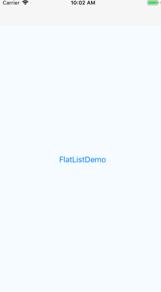

在APP开发过程中，列表可谓是页面最重要的一种展现形式了，几乎每一个APP都离不了列表，那么在这篇文章中将向大家分享在React Native中该如何实现列表，以及FlatList的原理和实用指南。

在React Native的早期版本中列表通常使用`ListView`来实现，新版React Native推荐我们使用FlatList来实现列表，那么为什么推荐使用FlatList列表呢？接下来就让我从FlatList的由来说起。

## FlatList的由来？

在React Native0.43版本中引入了`FlatList`,`SectionList`与`VirtualizedList`，其中`VirtualizedList`是FlatList 与 SectionList 的底层实现。


> 可能有人要问了，既然有了ListView，那为什么还要设计一个FlatList出来呢？

经常使用ListView的同学都知道： ListView的性能是比较差的，尤其是当有大量的数据需要展示的时候，ListView对内存的占用是相当可观的、丢帧卡顿那是常有的事。

> 为什么ListView对于大数据量的情况下性能会很差呢？

深入ListView的原理你会发现，ListView对列表中的Item是全量渲染的，并且没有复用机制，这就难以避免当让ListView渲染大数据量的时候会发生以下两个问题：

- 第一次打开与切换Tab时会出现卡顿或白屏的情况：这是因为ListView对所有的Item都是全量渲染的，比如：ListView中有100条Item，只有等这100条Item都渲染完成，ListView中的内容才会展示，这就难以避免卡顿白屏的问题；
- 滑动列表时会出现卡顿与不跟手：当因ListView中展示了大量数据的时候，滑动列表你会发现没有少量数据的时候的跟手与流畅，这是因为ListView为了渲染大量数据需要大量的内存和计算，这对手机资源是一个很大的消耗，尤其是在一些低端机上甚至会出现OOM；

ListView的这种性能问题一直困扰着React Native开发者。有能力的公司、团队都纷纷对ListView做优化，封装自己的列表组件，然对性能的提升并不大，所以现在急需一个高性能的列表组件，于是便有了设计FlatList的构想；

> 那FlatList都有哪些特性能呢？

FlatList是基于VirtualizedList的，要说FlatList的特性还要从VirtualizedList说起：

## VirtualizedList

VirtualizedList 是FlatList 与 SectionList 的底层实现。Vritualization 通过维护一个有限的渲染窗口（其中包含可见的元素），并将渲染窗口之外的元素全部用合适的定长空白空间代替的方式，极大的改善了内存消耗以及在有大量数据情况下的使用性能。这个渲染窗口能响应滚动行为。当一个元素离可视区太远时，它就有一个较低优先级；否则就获得一个较高的优先级。渲染窗口通过这种方式逐步渲染其中的元素（在进行了任何交互之后），以尽量减少出现空白区域的可能性。


### 特性

VirtualizedList有以下特性：

- 支持滚动加载(具体可以借助onEndReached的回调，做数据动态加载)；
- 支持下拉刷新(借助onRefresh / refreshing属性实现)；
- 支持可配置的可见性（VPV）回调（借助onViewableItemsChanged / viewabilityConfig实现）
- 滑动方向增加对Horizontal(水平)方向的支持；
- 更加智能的Item以及section separators支持；
- 支持Multi-column(借助numColumns属性实现)；
- 添加scrollToEnd, scrollToIndex, 和 scrollToItem方法的支持；
- 对 Flow更加友好；

### 性能

VirtualizedList除了简化API之外，新的列表组件还具有显着的性能增强，主要的是对于任意数量的行(Item)的增加不会带着内存的增加。 它主要是通过虚拟元素也就是在渲染窗口之外的元素将会被从组件结构上卸载以达到回收内存目的。这样会带来一个问题，即内部组件状态不会被保留，因此请确保你跟踪组件本身以外的任何重要状态，例如， 在Relay或Redux或Flux store。

限制渲染窗口还可以减少React和本地平台的工作量，例如View遍历。 即使你渲染了最后的一百万个元素，用这些新的列表也不需要渲染所有的元素来完成遍历。比如：你可以使用scrollToIndex跳至中间位置，而无需过多渲染。

另外VirtualizedList还对调度进行了一些改进，这对应用程序的响应很有帮助。 在任何手势或动画或其他交互完成后，呈现在窗口边缘的Item不会被频繁的渲染，并且渲染优先级比较低。

### 高级使用

- 与ListView不同的是，渲染窗口中的所有Item在任何props改变时都会重新渲染，这在通常情况下是比较好的，因为渲染窗口的Item数量是不变的，但是如果Item比较复杂的话，你因该应确保遵循React最佳性能实践，并在适当情况下使用React.PureComponent和/或shouldComponentUpdate来限制你的组件以及子组件的渲染次数，减少不必要的渲染以及递归渲染等。
- 如果你不需要渲染就知道内容的高度的话，可以通过getItemLayout 属性来改善用户体验，这使得通过例如滚动到具体Item更平滑。比如使用 scrollToIndex滚动到指定的Item。
- 如果你有另一种数据类型比如immutable的list, 那么使用`VirtualizedList`是个不错的选择. 它提供一个getItem属性来让你为任何给定的index返回item数据。

### 注意事项

- 当某行滑出渲染区域之外后，其内部状态将不会保留。请确保你在行组件以外的地方保留了数据。
- 本组件继承自PureComponent而非通常的Component，这意味着如果其props在浅比较中是相等的，则不会重新渲染。所以请先检查你的renderItem函数所依赖的props数据（包括data属性以及可能用到的父组件的state），如果是一个引用类型（Object或者数组都是引用类型），则需要先修改其引用地址（比如先复制到一个新的Object或者数组中），然后再修改其值，否则界面很可能不会刷新。（译注：这一段不了解的朋友建议先学习下js中的基本类型和引用类型。）
- 为了优化内存占用同时保持滑动的流畅，列表内容会在屏幕外异步绘制。这意味着如果用户滑动的速度超过渲染的速度，则会先看到空白的内容。这是为了优化不得不作出的妥协，而我们也在设法持续改进。
- 默认情况下每行都需要提供一个不重复的key属性。你也可以提供一个keyExtractor函数来生成key。
- 另外如果你有一些特殊的需求或用例，你也通过调整一些参数来实现。 例如，你可以使用windowSize来平衡内存使用情况与用户体验，使用maxToRenderPerBatch调整填充率与响应度，使用onEndReachedThreshold以控制何时发生滚动加载等等。

### React Native列表的未来规划

- 完成现有的迁移（最终弃用ListView）。
- 实现一些看到或听到的好的功能。
- 粘滞头部支持。
- 更多的性能优化。
- 支持具有状态的功能Item组件。

了解完`VirtualizedList`之后，接下来就让我们来认识一下FlatList的一些特性吧：

## FlatList的特性

高性能的且使用简单的列表组件，支持一些特性：

- 完全跨平台；
- 支持水平布局模式；
- 行组件显示或隐藏时可配置回调事件；
- 支持单独的头部组件；
- 支持单独的尾部组件；
- 支持自定义行间分隔线；
- 支持下拉刷新；
- 支持上拉加载；
- 支持跳转到指定行（ScrollToIndex）；

如果需要分组/类/区（section）的功能，请使用`<SectionList>`。

### 简单使用

```react
<FlatList
  data={[{key: 'a'}, {key: 'b'}]}
  renderItem={({item}) => <Text>{item.key}</Text>} />
```

> [查看全部完整代码](https://coding.imooc.com/class/304.html)。

### 注意事项

FlatList组件实质是基于`<VirtualizedList>`组件的封装，因此除了`<VirtualizedList>`需要注意的事项之外还有下面这些需要注意的事项：

- `removeClippedSubviews`属性目前是不必要的，而且可能会引起问题。如果你在某些场景碰到内容不渲染的情况（比如使用LayoutAnimation时），尝试设置removeClippedSubviews={false}。我们可能会在将来的版本中修改此属性的默认值。

### 属性

> ```
> data: ?Array<ItemT>
> ```

为了简化起见，data属性目前只支持普通数组。如果需要使用其他特殊数据结构，例如immutable数组，请直接使用更底层的VirtualizedList组件。

> ```
> renderItem: (info: {item: ItemT, index: number}) => ?React.Element<any>
> ```

根据行数据data渲染每一行的组件。典型用法：

```react
_renderItem = ({item}) => ( 
<TouchableOpacity 
	onPress={() => this._onPress(item)}>
	<Text>{item.title}}</Text> 
</TouchableOpacity> 
);
... 
<FlatList 
	data={[{title: 'Title Text', key: 'item1'}]} 
	renderItem={this._renderItem} 
/>
```

> [查看全部完整代码](https://coding.imooc.com/class/304.html)。

除data外还有第二个参数index可供使用。

> ```
> onRefresh?: ?() => void
> ```

如果设置了此选项，则会在列表头部添加一个标准的RefreshControl控件，以便实现“下拉刷新”的功能。同时你需要正确设置refreshing属性。

> ```
> refreshing?: ?boolean
> ```

在等待加载新数据时将此属性设为true，列表就会显示出一个正在加载的符号。

> ```
> horizontal?: ?boolean
> ```

设置为true则变为水平布局模式。

> ```
> initialNumToRender: number
> ```

指定一开始渲染的元素数量，最好刚刚够填满一个屏幕，这样保证了用最短的时间给用户呈现可见的内容。注意这第一批次渲染的元素不会在滑动过程中被卸载，这样是为了保证用户执行返回顶部的操作时，不需要重新渲染首批元素。

> ```
> keyExtractor: (item: ItemT, index: number) => string
> ```

此函数用于为给定的item生成一个不重复的key。Key的作用是使React能够区分同类元素的不同个体，以便在刷新时能够确定其变化的位置，减少重新渲染的开销。若不指定此函数，则默认抽取item.key作为key值。若item.key也不存在，则使用数组下标。

> ```
> ItemSeparatorComponent?: ?ReactClass<any>
> ```

行与行之间的分隔线组件。不会出现在第一行之前和最后一行之后。

> ```
> ListFooterComponent?: ?ReactClass<any>
> ```

通过它设置尾部组件

> ```
> ListHeaderComponent?: ?ReactClass<any>
> ```

通过它设置头部组件

> ```
> columnWrapperStyle?: StyleObj
> ```

如果设置了多列布局（即将numColumns值设为大于1的整数），则可以额外指定此样式作用在每行容器上。

> ```
> extraData?: any
> ```

如果有除data以外的数据用在列表中（不论是用在renderItem还是Header或者Footer中），请在此属性中指定。同时此数据在修改时也需要先修改其引用地址（比如先复制到一个新的Object或者数组中），然后再修改其值，否则界面很可能不会刷新。

> ```
> getItem?:
> ```

获取指定的Item；

> ```
> getItemCount?:
> ```

用于获取总共有多少Item；

> ```
> getItemLayout?: (data: ?Array<ItemT>, index: number) => {length: number, offset: number, index: number}
> ```

`getItemLayout`是一个可选的优化，用于避免动态测量内容尺寸的开销，不过前提是你可以提前知道内容的高度。如果你的行高是固定的，getItemLayout用起来就既高效又简单，类似下面这样：

```
getItemLayout={(data, index) => ( {length: 行高, offset: 行高 * index, index} )}
```

注意如果你指定了SeparatorComponent，请把分隔线的尺寸也考虑到offset的计算之中。

> ```
> legacyImplementation?: ?boolean
> ```

设置为true则使用旧的ListView的实现。

> ```
> numColumns: number
> ```

多列布局只能在非水平模式下使用，即必须是horizontal={false}。此时组件内元素会从左到右从上到下按Z字形排列，类似启用了flexWrap的布局。组件内元素必须是等高的——暂时还无法支持瀑布流布局。

> ```
> onEndReached?: ?(info: {distanceFromEnd: number}) => void
> ```

当列表被滚动到距离内容最底部不足onEndReachedThreshold的距离时调用。

> ```
> onEndReachedThreshold?: ?number
> ```

决定当距离内容最底部还有多远时触发onEndReached回调。注意此参数是一个比值而非像素单位。比如，0.5表示距离内容最底部的距离为当前列表可见长度的一半时触发。

> ```
> onViewableItemsChanged?: ?(info: {viewableItems: Array<ViewToken>, changed: Array<ViewToken>}) => void
> ```

在可见行元素变化时调用。可见范围和变化频率等参数的配置请设置viewabilityconfig属性

> ```
> viewabilityConfig?: ViewabilityConfig
> ```

可参考ViewabilityHelper的源码来了解具体的配置。

### 方法

> ```
> scrollToEnd(params?: object)
> ```

滚动到底部。如果不设置getItemLayout属性的话，可能会比较卡。

> ```
> scrollToIndex(params: object)
> ```

滚动到指定位置，如果不设置getItemLayout属性的话，可能会比较卡。

> ```
> scrollToItem(params: object)
> ```

需要线性扫描数据 - 如果可能，请使用scrollToIndex。如果不设置getItemLayout属性的话只能滚动到当前渲染窗口的某个位置。

> ```
> scrollToOffset(params: object)
> ```

滚动到列表中的特定内容像素偏移量。

> ```
> recordInteraction()
> ```

### 复杂使用

下面是一个较复杂的例子，其中演示了如何利用PureComponent来进一步优化性能和减少bug产生的可能：

- 对于`MyListItem`组件来说，其`onPressItem`属性使用箭头函数而非bind的方式进行绑定，使其不会在每次列表重新render时生成一个新的函数，从而保证了props的不变性（当然前提是 id、selected和title也没变），不会触发自身无谓的重新render。换句话说，如果你是用bind来绑定onPressItem，每次都会生成一个新的函数，导致props在===比较时返回false，从而触发自身的一次不必要的重新render。
- 给FlatList指定extraData={this.state}属性，是为了保证state.selected变化时，能够正确触发FlatList的更新。如果不指定此属性，则FlatList不会触发更新，因为它是一个PureComponent，其props在===比较中没有变化则不会触发更新。
- keyExtractor属性指定使用id作为列表每一项的key。

```react
class MyListItem extends React.PureComponent {
  _onPress = () => {
    this.props.onPressItem(this.props.id);
  };

  render() {
    retuReact Native (
      <SomeOtherWidget
        {...this.props}
        onPress={this._onPress}
      />     )
  }
}

class MyList extends React.PureComponent { 
  state = {selected: (new Map(): Map<string, boolean>)};

  _keyExtractor = (item, index) => item.id;

  _onPressItem = (id: string) => {
    // updater functions are preferred for transactional updates
    this.setState((state) => {
      // copy the map rather than modifying state.
      const selected = new Map(state.selected);
      selected.set(id, !selected.get(id)); // toggle
      retuReact Native {selected};
    });
  };

  _renderItem = ({item}) => (
    <MyListItem
      id={item.id}
      onPressItem={this._onPressItem}
      selected={!!this.state.selected.get(item.id)}
      title={item.title}
    />   );

  render() {
    retuReact Native (
      <FlatList
        data={this.props.data}
        extraData={this.state}
        keyExtractor={this._keyExtractor}
        renderItem={this._renderItem}
      />     );
  }
}
```

> [查看全部完整代码](https://coding.imooc.com/class/304.html)。

### 实例：上拉加载更多，下拉刷新，自定义刷新组件



```react
const CITY_NAMES = ['北京', '上海', '广州', '深圳', '杭州', '苏州', '成都', '武汉', '郑州', '洛阳', '厦门', '青岛', '拉萨'];
export default class FlatListDemo extends Component<Props> {
    constructor(props) {
        super(props);
        this.state = {
            dataArray: CITY_NAMES,
            isLoading: false
        }
    }

    _renderItem(data) {
        retuReact Native <View style={styles.item}>
            <Text style={styles.text}>{data.item}</Text>         </View>     }

    loadData(refresh) {
        if (refresh) {
            this.setState({
                isLoading: true
            });
        }
        setTimeout(() => {
            let dataArray = [];
            if (refresh) {
                for (let i = this.state.dataArray.length - 1; i >= 0; i--) {
                    dataArray.push(this.state.dataArray[i])
                }
            } else {
                dataArray = this.state.dataArray.concat(CITY_NAMES);
            }
            this.setState({
                dataArray: dataArray,
                isLoading: false
            });
        }, 2000);
    }

    genIndicator() {
        retuReact Native <View style={styles.indicatorContainer}>
            <ActivityIndicator
                style={styles.indicator}
                size='large'
                animating={true}
            />             <Text>正在加载更多</Text>         </View>     }

    render() {
        retuReact Native (
            <View style={styles.container}>
                <FlatList
                    data={this.state.dataArray}
                    renderItem={(data => this._renderItem(data))}
                    // refreshing={this.state.isLoading}
                    // onRefresh={() => {
                    // this.loadData();
                    // }}
                    refreshControl={
                        <RefreshControl
                            title='Loading...'
                            colors={['red']}
                            refreshing={this.state.isLoading}
                            onRefresh={() => this.loadData(true)}
                            tintColor={'orange'}
                        />                     }
                    ListFooterComponent={() => this.genIndicator()}
                    onEndReached={() => {
                        this.loadData()
                    }}
                /> 
            </View>         );
    }
}

const styles = StyleSheet.create({
    container: {
        flex: 1,
    },
    item: {
        height: 200,
        backgroundColor: '#169',
        marginLeft: 15,
        marginRight: 15,
        marginBottom: 15,
        alignItems: 'center',
        justifyContent: 'center'
    },
    text: {
        color: 'white',
        fontSize: 20
    },
    indicatorContainer: {
        alignItems: "center"
    },
    indicator: {
        color: 'red',
        margin: 10
    }
});
```

> [查看全部完整代码](https://coding.imooc.com/class/304.html)。

> - 本节学习过程中遇到无法解决的问题可以在[课程问答区](https://coding.imooc.com/learn/qa/304.html)进行[提问](https://coding.imooc.com/learn/qa/304.html)，课程老师会对你进行辅导和帮助；
> - 欢迎加入课程官方群：579379877 和讲师以及其他师兄弟们一起学习交流；

## [参考资料](https://coding.imooc.com/class/304.html)

- [新版React Native+Redux打造高质量上线App](https://coding.imooc.com/class/304.html)