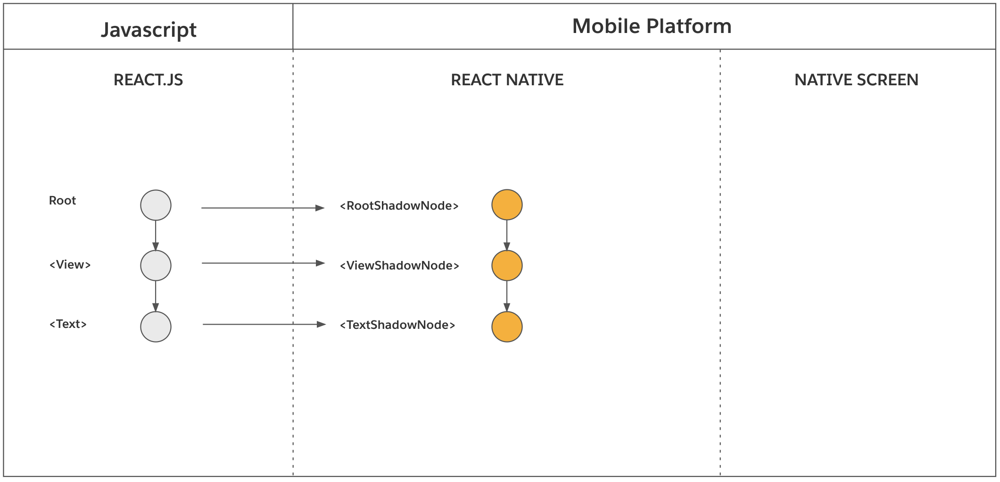
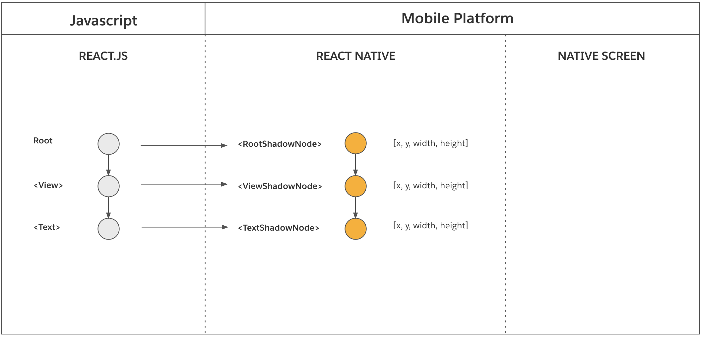
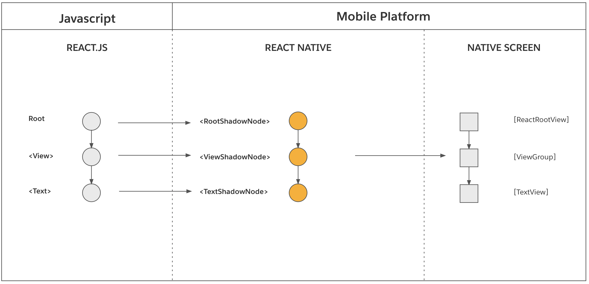
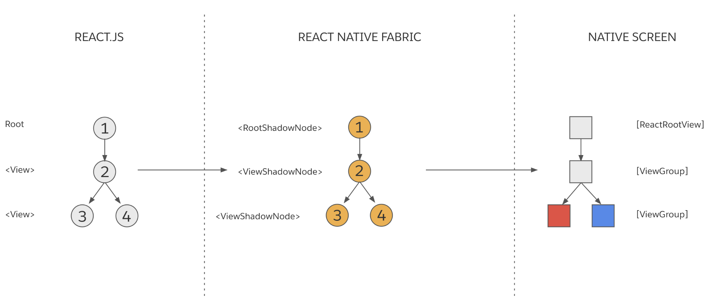
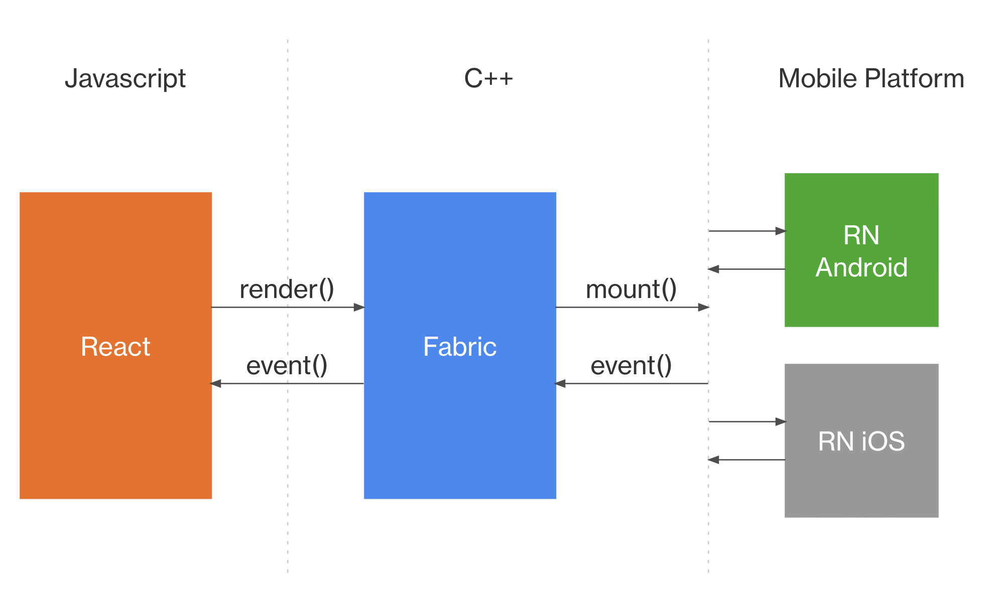
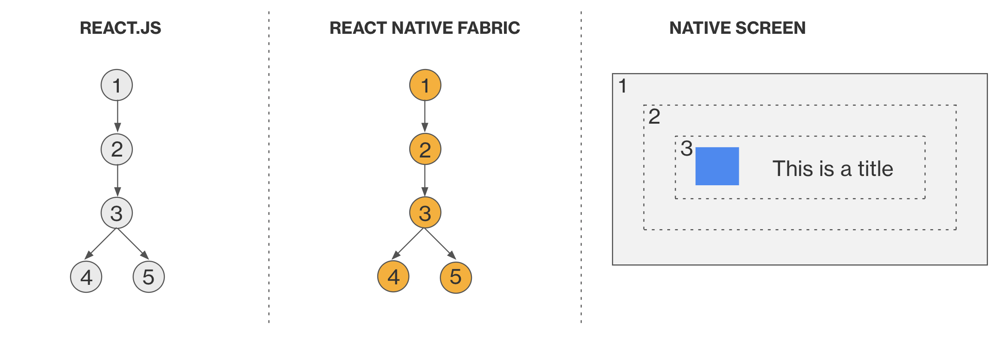
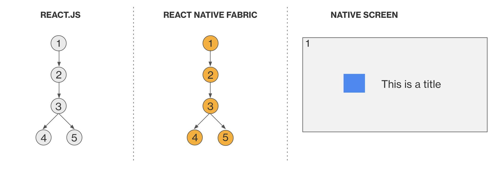
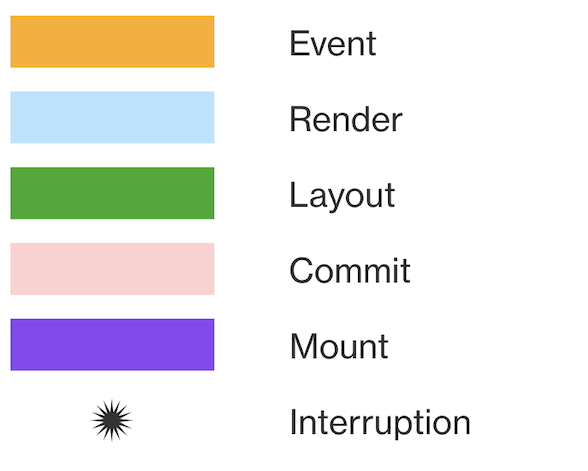

# Fabric

Fabric 是 React Native 新架构的渲染系统，是从老架构的渲染系统演变而来的。核心原理是在 C++ 层统一更多的渲染逻辑，提升与[宿主平台（host platforms）](https://www.react-native.cn/architecture/glossary#host-platform)互操作性，并为 React Native 解锁更多能力。其研发始于 2018 年。从 2021 年开始， Facebook App 中的 React Native 启用了新的渲染器。

该文档简介了[新渲染器（new renderer）](https://www.react-native.cn/architecture/glossary#fabric-render)及其核心概念，它不包括平台细节和任何代码细节，它介绍了核心概念、初衷、收益和不同场景的渲染流程。

> 名词解释：
>
> 宿主平台（Host platform）：React Native 嵌入的平台，比如 Android、iOS、Windows、macOS。
>
> Fabric 渲染器（Fabric Renderer）：React Native 执行的 React 框架代码，和 React 在 Web 中执行代码是同一份。但是，React Native 渲染的是通用平台视图（宿主视图）而不是 DOM 节点（可以认为 DOM 是 Web 的宿主视图）。 Fabric 渲染器使得渲染宿主视图变得可行。Fabric 让 React 与各个平台直接通信并管理其宿主视图实例。 Fabric 渲染器存在于 JavaScript 中，并且它调用的是由 C++ 代码暴露的接口。在这篇文章中有更多关于 React 渲染器的信息。

## [新渲染器的初衷和收益](https://www.react-native.cn/architecture/fabric-renderer#新渲染器的初衷和收益)

开发新的渲染架构的初衷是为了更好的用户体验，而这种新体验是在老架构上是不可能实现的。比如：

- 为了提升宿主视图（host views）和 React 视图（React views）的互操作性，渲染器必须有能力同步地测量和渲染 React 界面。在老架构中，React Native 布局是异步的，这导致在宿主视图中渲染嵌套的 React Native 视图，会有布局“抖动”的问题。
- 借助多优先级和同步事件的能力，渲染器可以提高用户交互的优先级，来确保他们的操作得到及时的处理。
- React Suspense 的集成，允许你在 React 中更符合直觉地写请求数据代码。
- 允许你在 React Native 使用 React Concurrent 可中断渲染功能。
- 更容易实现 React Native 的服务端渲染。

新架构的收益还包括，代码质量、性能、可扩展性。

- **类型安全**：代码生成工具（code generation）确保了 JS 和宿主平台两方面的类型安全。代码生成工具使用 JavaScript 组件声明作为唯一事实源，生成 C++ 结构体来持有 props 属性。不会因为 JavaScript 和宿主组件 props 属性不匹配而出现构建错误。
- **共享 C++ core**：渲染器是用 C++ 实现的，其核心 core 在平台之间是共享的。这增加了一致性并且使得新的平台能够更容易采用 React Native。（译注：例如 VR 新平台）
- **更好的宿主平台互操作性**：当宿主组件集成到 React Native 时，同步和线程安全的布局计算提升了用户体验（译注：没有异步的抖动）。这意味着那些需要同步 API 的宿主平台库，变得更容易集成了。
- **性能提升**：新的渲染系统的实现是跨平台的，每个平台都从那些原本只在某个特定平台的实现的性能优化中，得到了收益。比如拍平视图层级，原本只是 Android 上的性能优化方案，现在 Android 和 iOS 都直接有了。
- **一致性**：新的渲染系统的实现是跨平台的，不同平台之间更容易保持一致。
- **更快的启动速度**：默认情况下，宿主组件的初始化是懒执行的。
- **JS 和宿主平台之间的数据序列化更少**：React 使用序列化 JSON 在 JavaScript 和宿主平台之间传递数据。新的渲染器用 JSI（JavaScript Interface）直接获取 JavaScript 数据。

# 渲染，提交与挂载（渲染流水线）

This document refers to the architecture of the new renderer, [Fabric](https://www.react-native.cn/architecture/fabric-renderer), that is in active roll-out.

React Native 渲染器通过一系列加工处理，将 React 代码渲染到[宿主平台](https://www.react-native.cn/architecture/glossary#host-platform)。这一系列加工处理就是渲染流水线（pipeline），它的作用是初始化渲染和 UI 状态更新。 接下来介绍的是渲染流水线，及其在各种场景中的不同之处。

（译注：pipeline 的原义是将计算机指令处理过程拆分为多个步骤，并通过多个硬件处理单元并行执行来加快指令执行速度。其具体执行过程类似工厂中的流水线，并因此得名。）

渲染流水线可大致分为三个阶段：

- 渲染（Render）：在 JavaScript 中，React 执行那些产品逻辑代码创建 [React 元素树（React Element Trees）](https://www.react-native.cn/architecture/glossary#react-element-tree-and-react-element)。然后在 C++ 中，用 React 元素树创建 [React 影子树（React Shadow Tree）](https://www.react-native.cn/architecture/glossary#react-shadow-tree-and-react-shadow-node)。
- 提交（Commit）：在 React 影子树完全创建后，渲染器会触发一次提交。这会将 React 元素树和新创建的 React 影子树的提升为“下一棵要挂载的树”。 这个过程中也包括了布局信息计算。
- 挂载（Mount）：React 影子树有了布局计算结果后，它会被转化为一个[宿主视图树（Host View Tree）](https://www.react-native.cn/architecture/glossary#host-view-tree-and-host-view)。

> 渲染流水线的各个阶段可能发生在不同的线程中，更详细的信息可以参考线程模型部分。


渲染流水线存在三种不同场景：

1. 初始化渲染
2. React 状态更新
3. React Native 渲染器的状态更新

------

## [初次渲染](https://www.react-native.cn/architecture/render-pipeline#初次渲染)

想象一下你准备渲染一个组件：

```jsx
function MyComponent() {
  return (
    <View>
      <Text>Hello, World</Text>
    </View>
  );
}

// <MyComponent />
```


在上面的例子中，` <MyComponent />`是 React 元素。React 会将 React 元素简化为最终的 React 宿主组件。每一次都会递归地调用函数组件 MyComponet ，或类组件的 render 方法，直至所有的组件都被调用过。现在，你拥有一棵 React 宿主组件的 React 元素树。

### [阶段一：渲染](https://www.react-native.cn/architecture/render-pipeline#阶段一渲染)


在元素简化的过程中，每调用一个 React 元素，渲染器同时会**同步**地创建 React 影子节点。这个过程只发生在 React 宿主组件上，不会发生在 React 复合组件上。比如，一个 `<View>`会创建一个 `ViewShadowNode` 对象，一个`<Text>`会创建一个`TextShadowNode`对象。注意，`<MyComponent>`并没有直接对应的 React 影子节点。

在 React 为两个 React 元素节点创建一对父子关系的同时，渲染器也会为对应的 React 影子节点创建一样的父子关系。这就是影子节点的组装方式。

**其他细节**

- 创建 React 影子节点、创建两个影子节点的父子关系的操作是同步的，也是线程安全的。该操作的执行是从 React（JavaScript）到渲染器（C++）的，大部分情况下是在 JavaScript 线程上执行的。（译注：后面线程模型有解释）
- React 元素树和元素树中的元素并不是一直存在的，它只一个当前视图的描述，而最终是由 React “fiber” 来实现的。每一个 “fiber” 都代表一个宿主组件，存着一个 C++ 指针，指向 React 影子节点。这些都是因为有了 JSI 才有可能实现的。学习更多关于 “fibers” 的资料参考[这篇文档](https://github.com/acdlite/react-fiber-architecture#what-is-a-fiber)。
- React 影子树是不可变的。为了更新任意的 React 影子节点，渲染器会创建了一棵新的 React 影子树。为了让状态更新更高效，渲染器提供了 clone 操作。更多细节可参考后面的 React 状态更新部分。

在上面的示例中，各个渲染阶段的产物如图所示：



在 React 影子树创建完成后，渲染器触发了一次 React 元素树的提交。

### [阶段二：提交](https://www.react-native.cn/architecture/render-pipeline#阶段二提交)


提交阶段（Commit Phase）由两个操作组成：布局计算和树的提升。

- **布局计算（Layout Calculation）**：这一步会计算每个 React 影子节点的位置和大小。在 React Native 中，每一个 React 影子节点的布局都是通过 Yoga 布局引擎来计算的。实际的计算需要考虑每一个 React 影子节点的样式，该样式来自于 JavaScript 中的 React 元素。计算还需要考虑 React 影子树的根节点的布局约束，这决定了最终节点能够拥有多少可用空间。



- **树提升，从新树到下一棵树（Tree Promotion，New Tree → Next Tree）**：这一步会将新的 React 影子树提升为要挂载的下一棵树。这次提升代表着新树拥有了所有要挂载的信息，并且能够代表 React 元素树的最新状态。下一棵树会在 UI 线程下一个“tick”进行挂载。（译注：tick 是 CPU 的最小时间单元）

**更多细节**

- 这些操作都是在后台线程中异步执行的。
- 绝大多数布局计算都是 C++ 中执行，只有某些组件，比如 Text、TextInput 组件等等，的布局计算是在宿主平台执行的。文字的大小和位置在每个宿主平台都是特别的，需要在宿主平台层进行计算。为此，Yoga 布局引擎调用了宿主平台的函数来计算这些组件的布局。

### [阶段三：挂载](https://www.react-native.cn/architecture/render-pipeline#阶段三挂载)


挂载阶段（Mount Phase）会将已经包含布局计算数据的 React 影子树，转换为以像素形式渲染在屏幕中的宿主视图树。请记住，这棵 React 元素树看起来是这样的：

```jsx
<View>
  <Text>Hello, World</Text>
</View>
```


站在更高的抽象层次上，React Native 渲染器为每个 React 影子节点创建了对应的宿主视图，并且将它们挂载在屏幕上。在上面的例子中，渲染器为`<View>` 创建了`android.view.ViewGroup` 实例，为 `<Text>` 创建了文字内容为“Hello World”的 `android.widget.TextView`实例 。iOS 也是类似的，创建了一个 `UIView` 并调用 `NSLayoutManager` 创建文本。然后会为宿主视图配置来自 React 影子节点上的属性，这些宿主视图的大小位置都是通过计算好的布局信息配置的。



更详细地说，挂载阶段由三个步骤组成：

- **树对比（Tree Diffing）：** 这个步骤完全用的是 C++ 计算的，会对比“已经渲染的树”（previously rendered tree）和”下一棵树”之间的差异。计算的结果是一系列宿主平台上的原子变更操作，比如 `createView`, `updateView`, `removeView`, `deleteView` 等等。在这个步骤中，还会将 React 影子树拍平，来避免不必要的宿主视图创建。关于视图拍平的算法细节可以在后文找到。
- **树提升，从下一棵树到已渲染树（Tree Promotion，Next Tree → Rendered Tree）：**在这个步骤中，会自动将“下一棵树”提升为“先前渲染的树”，因此在下一个挂载阶段，树的对比计算用的是正确的树。
- **视图挂载（View Mounting）：**这个步骤会在对应的原生视图上执行原子变更操作，该步骤是发生在原生平台的 UI 线程的。

**更多细节**

- 挂载阶段的所有操作都是在 UI 线程同步执行的。如果提交阶段是在后台线程执行，那么在挂载阶段会在 UI 线程的下一个“tick”执行。另外，如果提交阶段是在 UI 线程执行的，那么挂载阶段也是在 UI 线程执行。
- 挂载阶段的调度和执行很大程度取决于宿主平台。例如，当前 Android 和 iOS 挂载层的渲染架构是不一样的。
- 在初始化渲染时，“先前渲染的树”是空的。因此，树对比（tree diffing）步骤只会生成一系列仅包含创建视图、设置属性、添加视图的变更操作。而在接下来的 React 状态更新场景中，树对比的性能至关重要。
- 在当前生产环境的测试中，在视图拍平之前，React 影子树通常由大约 600-1000 个 React 影子节点组成。在视图拍平之后，树的节点数量会减少到大约 200 个。在 iPad 或桌面应用程序上，这个节点数量可能要乘个 10。

## [React 状态更新](https://www.react-native.cn/architecture/render-pipeline#react-状态更新)

接下来，我们继续看 React 状态更新时，渲染流水线（render pipeline）的各个阶段是什么样的。假设你在初始化渲染时，渲染的是如下组件：

```jsx
function MyComponent() {
  return (
    <View>
      <View
        style={{ backgroundColor: 'red', height: 20, width: 20 }}
      />
      <View
        style={{ backgroundColor: 'blue', height: 20, width: 20 }}
      />
    </View>
  );
}
```


应用我们在[初次渲染](https://www.react-native.cn/architecture/render-pipeline#初次渲染)部分学的知识，你可以得到如下的三棵树：



请注意，节点 3 对应的宿主视图背景是**红的**，而**节点 4** 对应的宿主视图背景是**蓝的**。假设 JavaScript 的产品逻辑是，将第一个内嵌的`<View>`的背景颜色由红色改为黄色。新的 React 元素树看起来大概是这样：

```jsx
<View>
  <View
    style={{ backgroundColor: 'yellow', height: 20, width: 20 }}
  />
  <View
    style={{ backgroundColor: 'blue', height: 20, width: 20 }}
  />
</View>
```


**React Native 是如何处理这个更新的？**

从概念上讲，当发生状态更新时，为了更新已经挂载的宿主视图，渲染器需要直接更新 React 元素树。 但是为了线程的安全，React 元素树和 React 影子树都必须是不可变的（immutable）。这意味着 React 并不能直接改变当前的 React 元素树和 React 影子树，而是必须为每棵树创建一个包含新属性、新样式和新子节点的新副本。

让我们继续探究状态更新时，渲染流水线的各个阶段发生了什么。

### [阶段一：渲染](https://www.react-native.cn/architecture/render-pipeline#阶段一渲染-1)


React 要创建了一个包含新状态的新的 React 元素树，它就要复制所有变更的 React 元素和 React 影子节点。 复制后，再提交新的 React 元素树。

React Native 渲染器利用结构共享的方式，将不可变特性的开销变得最小。为了更新 React 元素的新状态，从该元素到根元素路径上的所有元素都需要复制。 **但 React 只会复制有新属性、新样式或新子元素的 React 元素**，任何没有因状态更新发生变动的 React 元素都不会复制，而是由新树和旧树共享。

在上面的例子中，React 创建新树使用了这些操作：

1. CloneNode(**Node 3**, {backgroundColor: 'yellow'}) → **Node 3'**
2. CloneNode(**Node 2**) → **Node 2'**
3. AppendChild(**Node 2'**, **Node 3'**)
4. AppendChild(**Node 2'**, **Node 4**)
5. CloneNode(**Node 1**) → **Node 1'**
6. AppendChild(**Node 1'**, **Node 2'**)

操作完成后，**节点 1'（Node 1'）**就是新的 React 元素树的根节点。我们用 **T** 代表“先前渲染的树”，用 **T'** 代表“新树”。


注意节点 4 在 **T** and **T'** 之间是共享的。结构共享提升了性能并减少了内存的使用。

### [阶段二：提交](https://www.react-native.cn/architecture/render-pipeline#阶段二提交-1)


在 React 创建完新的 React 元素树和 React 影子树后，需要提交它们。

- **布局计算（Layout Calculation）：**状态更新时的布局计算，和初始化渲染的布局计算类似。一个重要的不同之处是布局计算可能会导致共享的 React 影子节点被复制。这是因为，如果共享的 React 影子节点的父节点引起了布局改变，共享的 React 影子节点的布局也可能发生改变。

- **树提升（Tree Promotion ，New Tree → Next Tree）:** 和初始化渲染的树提升类似。

- 树对比（Tree Diffing）：

  这个步骤会计算“先前渲染的树”（T）和“下一棵树”（T'）的区别。计算的结果是原生视图的变更操作。

  - 在上面的例子中，这些操作包括：`UpdateView(**Node 3'**, {backgroundColor: '“yellow“})`

### [阶段三：挂载](https://www.react-native.cn/architecture/render-pipeline#阶段三挂载-1)


- **树提升（Tree Promotion ，Next Tree → Rendered Tree）:** 在这个步骤中，会自动将“下一棵树”提升为“先前渲染的树”，因此在下一个挂载阶段，树的对比计算用的是正确的树。
- **视图挂载（View Mounting）：**这个步骤会在对应的原生视图上执行原子变更操作。在上面的例子中，只有**视图 3（View 3）**的背景颜色会更新，变为黄色。 

------

## [React Native 渲染器状态更新](https://www.react-native.cn/architecture/render-pipeline#react-native-渲染器状态更新)

对于影子树中的大多数信息而言，React 是唯一所有方也是唯一事实源。并且所有来源于 React 的数据都是单向流动的。

但有一个例外。这个例外是一种非常重要的机制：C++ 组件可以拥有状态，且该状态可以不直接暴露给 JavaScript，这时候 JavaScript （或 React）就不是唯一事实源了。通常，只有复杂的宿主组件才会用到 C++ 状态，绝大多数宿主组件都不需要此功能。

例如，ScrollView 使用这种机制让渲染器知道当前的偏移量是多少。偏移量的更新是宿主平台的触发，具体地说是 ScrollView 组件。这些偏移量信息在 React Native 的 [measure](https://www.react-native.cn/docs/direct-manipulation#measurecallback) 等 API 中有用到。 因为偏移量数据是由 C++ 状态持有的，所以源于宿主平台更新，不影响 React 元素树。

从概念上讲，C++ 状态更新类似于我们前面提到的 React 状态更新，但有两点不同：

1. 因为不涉及 React，所以跳过了“渲染阶段”（Render phase）。
2. 更新可以源自和发生在任何线程，包括主线程。

### [阶段二：提交](https://www.react-native.cn/architecture/render-pipeline#阶段二提交-2)


提交阶段（Commit Phase）：在执行 C++ 状态更新时，会有一段代码把影子节点**（N）**的 C++ 状态设置为值 **S**。React Native 渲染器会反复尝试获取 **N** 的最新提交版本，并使用新状态 **S** 复制它 ，并将新的影子节点 **N'** 提交给影子树。如果 React 在此期间执行了另一次提交，或者其他 C++ 状态有了更新，本次 C++ 状态提交失败。这时渲染器将多次重试 C++ 状态更新，直到提交成功。这可以防止真实源的冲突和竞争。

### [阶段三：挂载](https://www.react-native.cn/architecture/render-pipeline#阶段三挂载-2)


挂载阶段（Mount Phase）实际上与 React 状态更新的挂载阶段相同。渲染器仍然需要重新计算布局、执行树对比等操作。详细步骤在前面已经讲过了。

# 跨平台的实现

This document refers to the architecture of the new renderer, [Fabric](https://www.react-native.cn/architecture/fabric-renderer), that is in active roll-out.

#### [React Native 渲染器使用了一个跨平台的核心渲染系统](https://www.react-native.cn/architecture/xplat-implementation#react-native-渲染器使用了一个跨平台的核心渲染系统)

在上一代 React Native 渲染器中，React 影子树、布局逻辑、视图拍平算法是在各个平台单独实现的。当前的渲染器的设计上采用的是跨平台的解决方案，共享了核心的 C++ 实现。

React Native 团队计划将动画系统加入到渲染系统中，并将 React Native 的渲染系统扩展到新的平台，例如 Windows、游戏机、电视等等。

使用 C++ 作为核心渲染系统有几个有点。首先，单一实现降低了开发和维护成本。其次，它提升了创建 React 影子树的性能，同时在 Android 上，也因为不再使用 JNI for Yoga，降低了 Yoga 渲染引擎的开销，布局计算的性能也有所提升。最后，每个 React 影子节点在 C++ 中占用的内存，比在 Kotlin 或 Swift 中占用的要小。

React Native 团队还使用了强制不可变的 C++ 特性，来确保并发访问时共享资源即便不加锁保护，也不会有问题。

但在 Android 端还有两种例外，渲染器依然会有 JNI 的开销：

- 复杂视图，比如 Text、TextInput 等，依然会使用 JNI 来传输属性 props。
- 在挂载阶段依然会使用 JNI 来发送变更操作。

React Native 团队在探索使用 `ByteBuffer` 序列化数据这种新的机制，来替换 `ReadableMap`，减少 JNI 的开销。目标是将 JNI 的开销减少 35~50%。

渲染器提供了 C++ 与两边通信的 API：

- **(i)** 与 React 通信
- **(ii)** 与宿主平台通信

关于 **(i)** React 与渲染器的通信，包括**渲染（render）** React 树和监听**事件（event）**，比如 `onLayout`、`onKeyPress`、touch 等。

关于 **(ii)** React Native 渲染器与宿主平台的通信，包括在屏幕上**挂载（mount）**宿主视图，包括 create、insert、update、delete 宿主视图，和监听用户在宿主平台产生的**事件**。



# 视图拍平

This document refers to the architecture of the new renderer, [Fabric](https://www.react-native.cn/architecture/fabric-renderer), that is in active roll-out.

#### [视图拍平（View Flattening）是 React Native 渲染器避免布局嵌套太深的优化手段。](https://www.react-native.cn/architecture/view-flattening#视图拍平view-flattening是-react-native-渲染器避免布局嵌套太深的优化手段)

React API 在设计上希望通过组合的方式，实现组件声明和重用，这为更简单的开发提供了一个很好的模型。但是在实现中，API 的这些特性会导致一些 React 元素会嵌套地很深，而其中大部分 React 元素节点只会影响视图布局，并不会在屏幕中渲染任何内容。这就是所谓的**“只参与布局”**类型节点。

从概念上讲，React 元素树的节点数量和屏幕上的视图数量应该是 1:1 的关系。但是，渲染一个很深的“只参与布局”的 React 元素会导致性能变慢。

举个很常见的例子，例子中“只参与布局”视图导致了性能损耗。

想象一下，你要渲染一个标题。你有一个应用，应用中拥有外边距 `ContainerComponent`的容器组件，容器组件的子组件是 `TitleComponent` 标题组件，标题组件包括一个图片和一行文字。React 代码示例如下：

```jsx
function MyComponent() {
  return (
    <View>                          // ReactAppComponent
      <View style={{margin: 10}} /> // ContainerComponent
        <View style={{margin: 10}}> // TitleComponent
          <Image {...} />
          <Text {...}>This is a title</Text>
        </View>
      </View>
    </View>
  );
}
```


React Native 在渲染时，会生成以下三棵树：



注意视图 2 和视图 3 是“只参与布局”的视图，因为它们在屏幕上渲染只是为了提供 10 像素的外边距。

为了提升 React 元素树中“只参与布局”类型的性能，渲染器实现了一种视图拍平的机制来合并或拍平这类节点，减少屏幕中宿主视图的层级深度。该算法考虑到了如下属性，比如 `margin`, `padding`, `backgroundColor`, `opacity`等等。

视图拍平算法是渲染器的对比（diffing）阶段的一部分，这样设计的好处是我们不需要额外的 CPU 耗时，来拍平 React 元素树中“只参与布局”的视图。此外，作为 C++ 核心的一部分，视图拍平算法默认是全平台共用的。

在前面的例子中，视图 2 和视图 3 会作为“对比算法”（diffing algorithm）的一部分被拍平，而它们的样式结果会被合并到视图 1 中。



虽然，这种优化让渲染器少创建和渲染两个宿主视图，但从用户的角度看屏幕内容没有任何区别。

# 线程模型

This document refers to the architecture of the new renderer, [Fabric](https://www.react-native.cn/architecture/fabric-renderer), that is in active roll-out.

#### React Native 渲染器在多个线程之间分配[渲染流水线（render pipeline）](https://www.react-native.cn/architecture/render-pipeline)任务。[](https://www.react-native.cn/architecture/threading-model#react-native-渲染器在多个线程之间分配渲染流水线render-pipeline任务)

接下来我们会给线程模型下定义，并提供一些示例来说明渲染流水线的线程用法。

React Native 渲染器是线程安全的。从更高的视角看，在框架内部线程安全是通过不可变的数据结果保障的，其使用的是 C++ 的 const correctness 特性。这意味着，在渲染器中 React 的每次更新都会重新创建或复制新对象，而不是更新原有的数据结构。这是框架把线程安全和同步 API 暴露给 React 的前提。

渲染器使用三个不同的线程：

- UI 线程（主线程）：唯一可以操作宿主视图的线程。
- JavaScript 线程：这是执行 React 渲染阶段的地方。
- 后台线程：专门用于布局的线程。

让我们回顾一下每个阶段支持的执行场景：



## [渲染场景](https://www.react-native.cn/architecture/threading-model#渲染场景)

### [在后台线程中渲染](https://www.react-native.cn/architecture/threading-model#在后台线程中渲染)

这是最常见的场景，大多数的渲染流水线发生在 JavaScript 线程和后台线程。


------

### [在主线程中渲染](https://www.react-native.cn/architecture/threading-model#在主线程中渲染)

当 UI 线程上有高优先级事件时，渲染器能够在 UI 线程上同步执行所有渲染流水线。


------

### [默认或连续事件中断](https://www.react-native.cn/architecture/threading-model#默认或连续事件中断)

在这个场景中，UI 线程的低优先级事件中断了渲染步骤。React 和 React Native 渲染器能够中断渲染步骤，并把它的状态和一个在 UI 线程执行的低优先级事件合并。在这个例子中渲染过程会继续在后台线程中执行。


------

### [不相干的事件中断](https://www.react-native.cn/architecture/threading-model#不相干的事件中断)

渲染步骤是可中断的。在这个场景中， UI 线程的高优先级事件中断了渲染步骤。React 和渲染器是能够打断渲染步骤的，并把它的状态和 UI 线程执行的高优先级事件合并。在 UI 线程渲染步骤是同步执行的。


------

**来自 JavaScript 线程的后台线程批量更新**

在后台线程将更新分派给 UI 线程之前，它会检查是否有新的更新来自 JavaScript。 这样，当渲染器知道新的状态要到来时，它就不会直接渲染旧的状态。


------

### [C++ 状态更新](https://www.react-native.cn/architecture/threading-model#c-状态更新)

更新来自 UI 线程，并会跳过渲染步骤。更多细节请参考 [React Native 渲染器状态更新](https://www.react-native.cn/architecture/render-pipeline#react-native-renderer-state-updates)。

