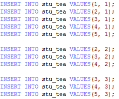

# DDL-约束

约束

\* 约束是添加在列上的，用来约束列的！

\1. 主键约束（唯一标识）

  ****非空***

  ****唯一***

  ****被引用****（学习外键时）

  \* 当表的某一列被指定为主键后，该列就不能为空，不能有重复值出现。

  \* 创建表时指定主键的两种方式：

​    \> 

​    CREATE TABLE stu(

​	sid	    CHAR(6) PRIMARY KEY,

​	sname	VARCHAR(20),

​	age		INT,

​	gender	VARCHAR(10) 

​    );

​    指定sid列为主键列，即为sid列添加主键约束

   

​    \> 

​    CREATE TABLE stu(

​	sid	    CHAR(6),

​	sname	VARCHAR(20),

​	age		INT,

​	gender	VARCHAR(10),

​	PRIMARY KEY(sid)

​    );

​    指定sid列为主键列，即为sid列添加主键约束

  

  \* 修改表时指定主键：ALTER TABLE stu ADD PRIMARY KEY(sid);

  

  \* 删除主键：ALTER TABLE stu DROP PRIMARY KEY;

 

\2. 主键自增长，自增长的主键必须是整数

  \* 因为主键列的特性是：必须唯一、不能为空，所以我们通常会指定主键类为整型，然后设置其自动增长，这样可以保证在插入数据时主键列的唯一和非空特性。

  \* 创建表时指定主键自增长

  CREATE TABLE stu(

​		sid INT PRIMARY KEY AUTO_INCREMENT,

​		sname	VARCHAR(20),

​		age		INT,

​		gender	VARCHAR(10)

  );

  

   

  \* 修改表时设置主键自增长：ALTER TABLE stu CHANGE sid sid INT AUTO_INCREMENT;

  \* 修改表时删除主键自增长：ALTER TABLE stu CHANGE sid sid INT;

  \* 测试主键自增长：

​    \> INSERT INTO stu VALUES(NULL, 'zhangSan',23,'male');

​    \> INSERT INTO stu(sname,age,gender) VALUES('zhangSan',23,'male');

\3. 非空约束

  \* 因为某些列不能设置为NULL值，所以可以对列添加非空约束。

  \* 例如：

  CREATE TABLE stu(

​		sid INT PRIMARY KEY AUTO_INCREMENT,

​		sname	VARCHAR(20) NOT NULL,

​		age		INT,

​		gender	VARCHAR(10)

  );

  \* 对sname列设置了非空约束

\4. 唯一约束

  \* 车库某些列不能设置重复的值，所以可以对列添加唯一约束。

  \* 例如：

  CREATE TABLE stu(

​		sid INT PRIMARY KEY AUTO_INCREMENT,

​		sname	VARCHAR(20) NOT NULL UNIQUE,

​		age		INT,

​		gender	VARCHAR(10)

  );

  \* 对sname列设置了非空约束

\5. 概念模型

对象模型：可以双向关联，而且引用的是对象，而不是一个主键！

关系模型：只能多方引用一方，而且引用的只是主键，而不是一整行记录。

对象模型：在java中是domain！！！例如：User、Student

is a

has a(关联)

  \> 1对1

  \> 1对多

  \> 多对多

use a

  

关系模型：在数据库中表！！！

  当我们要完成一个软件系统时，需要把系统中的实体抽取出来，形成概念模型。

  例如部门、员工都是系统中的实体。概念模型中的实体最终会成为Java中的类、数据库中表。

  实体之间还存在着关系，关系有三种：

  \* 1对多：例如每个员工都从属一个部门，而一个部门可以有多个员工，其中员工是多方，而部门是一方。

  \* 1对1：例如老公和老婆就是一对一的关系，一个老公只能有一个老婆，而一个老婆只能有一个老公。

  \* 多对多：老师与学生的关系就是多对多，一个老师可以有多个学生，一个学生可以有多个老师。

  概念模型在Java中成为实体类（javaBean）

  类就使用成员变量来完成关系，一般都是双向关联！

  多对一双向中关联，即员工关联部门，部门也关联员工

  class Employee {//多方关联一方

​     ...

​     private Department department;

  }

  class Department {//一方关联多方

​     ...

​     private List employees;

  }

  class Husband {

​     ...

​     private Wife wife;

  }

  class Wife {

​     ...

​     private Husband

  }

  class Student {

​     ...

​     private List teachers

  }

  class Teacher {

​     ...

​     private List students;

  }

\6. 外键约束

  \* 外键必须是另一表的主键的值(外键要引用主键！)

  \* 外键可以重复

  \* 外键可以为空

  \* 一张表中可以有多个外键！

   

引入不存在的外键会出错

​    

  

概念模型在数据库中成为表

  数据库表中的多对一关系，只需要在多方使用一个独立的列来引用1方的主键即可

  /*员工表*/

  create talbe emp (

​    empno int primary key,/*员工编号*/

​    ...

​    deptno int/*所属部门的编号*/

  );

  /*部门表*/

  create table dept (

​    deptno int  primary key,/*部门编号*/

​    ...

  );

  emp表中的deptno列的值表示当前员工所从属的部门编号。也就是说emp.deptno必须在dept表中是真实存在！

  但是我们必须要去对它进行约束，不然可能会出现员工所属的部门编号是不存在的。这种约束就是外键约束。

  我们需要给emp.deptno添加外键约束，约束它的值必须在dept.deptno中存在。外键必须是另一个表的主键！上级领到编号直接有的话员工的话这叫做自身关联自   	己外检必须是可以是重复的

  语法：CONSTRAINT 约束名称 FOREIGN KEY(外键列名) REFERENCES 关联表(关联表的主键) 

  创建表时指定外键约束

  create talbe emp (

​    empno int primary key,

​    ...

​    deptno int,

​    CONSTRAINT fk_emp FOREIGN KEY(mgr) REFERENCES emp(empno)  

  );

  修改表时添加外键约束

  ALERT TABLE emp

  ADD CONSTRAINT fk_emp_deptno FOREIGN KEY(deptno) REFERENCES dept(deptno);

  修改表时删除外键约束

  ALTER TABLE emp

  DROP FOREIGN KEY fk_emp_deptno;/*约束名称*/

  

\7. 数据库一对一关系

  在表中建立一对一关系比较特殊，需要让其中一张表的主键，即是主键又是外键。

  create table husband(

​    hid int PRIMARY KEY,

​    ...

  );

  

  create table wife(

​    wid int PRIMARY KEY,

​    ...

​    ADD CONSTRAINT fk_wife_wid FOREIGN KEY(wid) REFERENCES husband(hid)

  );

  

  其中wife表的wid即是主键，又是相对husband表的外键！

  husband.hid是主键，不能重复！

  wife.wid是主键，不能重复，又是外键，必须来自husband.hid。

  所以如果在wife表中有一条记录的wid为1，那么wife表中的其他记录的wid就不能再是1了，因为它是主键。

  同时在husband.hid中必须存在1这个值，因为wid是外键。这就完成了一对一关系。

 tip:  *****从表的主键即是外键！

\8. 数据库多对多关系

  tip: 在表中建立多对多关系需要使用中间表，即需要三张表，在中间表中使用两个外键，分别引用其他两个表的主键。

  create table student(

​    sid int PRIMARY KEY,

​    ...

  );

  create table teacher(

​    tid int PRIMARY KEY,

​    ...

  );

  

  create table stu_tea(

​    sid int,

​    tid int,

​    ADD CONSTRAINT fk_stu_tea_sid FOREIGN KEY(sid) REFERENCES student(sid),

​    ADD CONSTRAINT fk_stu_tea_tid FOREIGN KEY(tid) REFERENCES teacher(tid)

  );

   

  

  这时在stu_tea这个中间表中的每条记录都是来说明student和teacher表的关系

  例如在stu_tea表中的记录：sid为1001，tid为2001，这说明编号为1001的学生有一个编号为2001的老师

  sid    tid

  101    201 /*编号为101的学生有一个编号为201的老师*/

  101    202 /*编号为101的学生有一个编号为202的老师*/

  101    203 /*编号为101的学生有一个编号为203的老师*/

  102    201 /*编号为102的学生有一个编号为201的老师*/

  102    204 /*编号为102的学生有一个编号为204的老师*/

